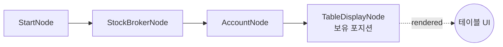

# 22-display-table: 테이블 디스플레이

## 목적
TableDisplayNode로 계좌 포지션을 테이블 형태로 표시합니다.

## 워크플로우 구조



## 노드 설명

### TableDisplayNode
- **역할**: 데이터를 테이블/그리드 형태로 표시
- **title**: `보유 포지션` (차트 제목)
- **data**: `{{ nodes.account.positions }}` (포지션 배열)
- **columns**: `["symbol", "exchange", "quantity", "pnl"]` (표시 컬럼)
- **limit**: `10` (최대 10행)
- **sort_by**: `pnl` (손익 기준 정렬)
- **sort_order**: `desc` (내림차순)

## 설정 옵션

### columns
표시할 컬럼을 지정합니다. 미지정 시 모든 필드가 표시됩니다.

```json
{
  "columns": ["symbol", "exchange", "quantity", "entry_price", "pnl"]
}
```

### 정렬 설정
| 필드 | 설명 |
|------|------|
| `sort_by` | 정렬 기준 필드명 |
| `sort_order` | `asc` (오름차순) / `desc` (내림차순) |

### limit
최대 표시 행 수 (1~100)

## 바인딩 테스트 포인트

| 표현식 | 예상 값 | 설명 |
|--------|---------|------|
| `{{ nodes.account.positions }}` | `[{...}, ...]` | 포지션 배열 |
| `{{ nodes.table.rendered }}` | `true` | 렌더링 완료 |

## 실행 결과 예시

### UI 렌더링
```
┌────────────────────────────────────────────┐
│ 보유 포지션                                 │
├─────────┬──────────┬──────────┬────────────┤
│ symbol  │ exchange │ quantity │ pnl        │
├─────────┼──────────┼──────────┼────────────┤
│ AAPL    │ NASDAQ   │ 50       │ 500.00     │
│ MSFT    │ NASDAQ   │ 20       │ -200.00    │
│ NVDA    │ NASDAQ   │ 10       │ 150.00     │
└─────────┴──────────┴──────────┴────────────┘
```

### JSON 응답
```json
{
  "nodes": {
    "table": {
      "rendered": true,
      "display_data": {
        "type": "table",
        "title": "보유 포지션",
        "columns": ["symbol", "exchange", "quantity", "pnl"],
        "rows": [
          {"symbol": "AAPL", "exchange": "NASDAQ", "quantity": 50, "pnl": 500.0},
          {"symbol": "MSFT", "exchange": "NASDAQ", "quantity": 20, "pnl": -200.0}
        ]
      }
    }
  }
}
```

## 활용 패턴

### 필터링 후 테이블
```json
{
  "data": "{{ nodes.account.positions.filter('pnl > 0') }}"
}
```
수익 포지션만 표시.

### 메서드 체이닝
```json
{
  "data": "{{ nodes.account.positions.filter('quantity > 10').all() }}"
}
```

## 관련 노드
- `TableDisplayNode`: display.py
- `OverseasStockAccountNode`: account_stock.py
