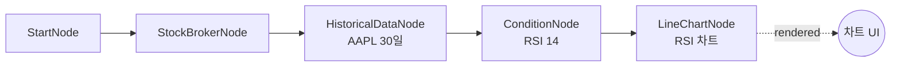

# 23-display-line-chart: 라인 차트 (RSI)

## 목적
LineChartNode로 RSI 지표의 시계열 차트를 표시합니다.

## 워크플로우 구조



## 노드 설명

### OverseasStockHistoricalDataNode
- **역할**: 과거 OHLCV 데이터 조회
- **symbol**: `{symbol: "AAPL", exchange: "NASDAQ"}`
- **period**: `1d` (일봉)
- **start_date**: `{{ date.ago(30, format='yyyymmdd') }}` (30일 전)
- **end_date**: `{{ date.today(format='yyyymmdd') }}` (오늘)

### ConditionNode (RSI)
- **역할**: RSI 지표 계산
- **plugin**: `RSI`
- **params**: `{period: 14, overbought: 70, oversold: 30}`
- **출력**: `values` (date, rsi, signal 포함)

### LineChartNode
- **역할**: 시계열 라인 차트 표시
- **title**: `AAPL RSI (14일)`
- **data**: `{{ nodes.condition.values }}`
- **x_field**: `date` (X축: 날짜)
- **y_field**: `rsi` (Y축: RSI 값)
- **signal_field**: `signal` (매매 시그널 마커)

## 필드 매핑

| 설정 | 설명 | 예시 |
|------|------|------|
| `x_field` | X축 데이터 필드 | `date`, `timestamp` |
| `y_field` | Y축 데이터 필드 | `rsi`, `price`, `value` |
| `signal_field` | 매매 시그널 필드 | `buy`/`sell` 마커 표시 |
| `side_field` | 포지션 방향 필드 | `long`/`short` 구분 |

## 바인딩 테스트 포인트

| 표현식 | 예상 값 | 설명 |
|--------|---------|------|
| `{{ nodes.condition.values }}` | `[{date, rsi, signal}, ...]` | RSI 데이터 |
| `{{ nodes.chart.rendered }}` | `true` | 렌더링 완료 |

## 실행 결과 예시

### ConditionNode 출력
```json
{
  "values": [
    {"date": "2025-12-30", "rsi": 45.2, "signal": null},
    {"date": "2025-12-31", "rsi": 28.5, "signal": "buy"},
    {"date": "2026-01-02", "rsi": 35.1, "signal": null}
  ]
}
```

### 차트 렌더링
```
AAPL RSI (14일)
100 ─┬─────────────────────────────────
     │ overbought (70)
 70 ─┼─ ─ ─ ─ ─ ─ ─ ─ ─ ─ ─ ─ ─ ─ ─ ─
     │      /\
 50 ─┤    /    \         /\
     │  /        \     /    \
 30 ─┼─ ─ ─ ─ ─ ─ ─\─/─ ─ ─ ─ ─ ─ ─ ─
     │  oversold (30)  ▲ buy
  0 ─┴─────────────────────────────────
     12/30  12/31  01/02  01/03  ...
```

### JSON 응답
```json
{
  "nodes": {
    "chart": {
      "rendered": true,
      "display_data": {
        "type": "line",
        "title": "AAPL RSI (14일)",
        "x_field": "date",
        "y_field": "rsi",
        "data": [...],
        "markers": [
          {"date": "2025-12-31", "signal": "buy"}
        ]
      }
    }
  }
}
```

## 활용 패턴

### 가격 차트
```json
{
  "data": "{{ nodes.historical.values }}",
  "x_field": "date",
  "y_field": "close"
}
```

### MACD 차트
```json
{
  "plugin": "MACD",
  "y_field": "macd"
}
```

## 관련 노드
- `LineChartNode`: display.py
- `ConditionNode`: condition.py
- `OverseasStockHistoricalDataNode`: historical.py
