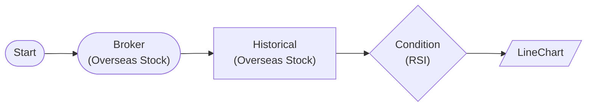

# Line Chart (RSI)

Display RSI time series chart with LineChartNode

## Workflow Structure



## Node List

| ID | Type | Description |
|----|------|------|
| start | StartNode | Workflow start |
| broker | OverseasStockBrokerNode | Overseas stock broker connection |
| historical | OverseasStockHistoricalDataNode | Overseas stock historical data query |
| condition | ConditionNode | Condition check (plugin-based) |
| chart | LineChartNode | Line chart |

## Key Settings

- **condition**: Plugin `RSI`

## Required Credentials

| ID | Type | Description |
|----|------|------|
| broker_cred | broker_ls_overseas_stock | LS Securities Overseas Stock API |

## Data Flow

1. **start** (StartNode) --> **broker** (OverseasStockBrokerNode)
1. **broker** (OverseasStockBrokerNode) --> **historical** (OverseasStockHistoricalDataNode)
1. **historical** (OverseasStockHistoricalDataNode) --> **condition** (ConditionNode)
1. **condition** (ConditionNode) --> **chart** (LineChartNode)

## How to Run

```python
from programgarden import ProgramGarden

pg = ProgramGarden()
job = await pg.run_async(workflow)
```
