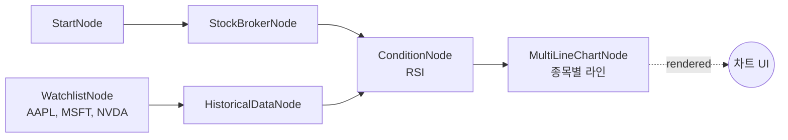

# 24-display-multi-line: 멀티라인 차트

## 목적
MultiLineChartNode로 여러 종목의 RSI를 하나의 차트에서 비교합니다.

## 워크플로우 구조



## 노드 설명

### WatchlistNode
- **역할**: 비교 대상 종목 목록 제공
- **symbols**: AAPL, MSFT, NVDA

### OverseasStockHistoricalDataNode (Auto-Iterate)
- **symbol**: `{{ item }}` (각 종목별 실행)
- **출력**: 종목별 OHLCV 데이터

### ConditionNode (RSI)
- **plugin**: `RSI`
- **출력**: 종목별 RSI 시계열 데이터

### MultiLineChartNode
- **역할**: 여러 시리즈를 하나의 차트에 표시
- **data**: `{{ lst.flatten(nodes.condition.values, 'time_series') }}`
- **x_field**: `date` (X축)
- **y_field**: `rsi` (Y축)
- **series_key**: `symbol` (시리즈 구분)

## lst.flatten 함수

여러 종목의 데이터를 단일 배열로 평탄화합니다.

### 입력 (종목별 분리)
```json
[
  {"symbol": "AAPL", "time_series": [{"date": "01-01", "rsi": 45}, ...]},
  {"symbol": "MSFT", "time_series": [{"date": "01-01", "rsi": 52}, ...]},
  {"symbol": "NVDA", "time_series": [{"date": "01-01", "rsi": 38}, ...]}
]
```

### 출력 (평탄화)
```json
[
  {"symbol": "AAPL", "date": "01-01", "rsi": 45},
  {"symbol": "AAPL", "date": "01-02", "rsi": 47},
  {"symbol": "MSFT", "date": "01-01", "rsi": 52},
  {"symbol": "MSFT", "date": "01-02", "rsi": 54},
  {"symbol": "NVDA", "date": "01-01", "rsi": 38},
  {"symbol": "NVDA", "date": "01-02", "rsi": 42}
]
```

## 차트 설정

| 필드 | 설명 | 예시 |
|------|------|------|
| `series_key` | 시리즈 구분 필드 | `symbol` |
| `x_field` | X축 필드 | `date` |
| `y_field` | Y축 필드 | `rsi` |

## 바인딩 테스트 포인트

| 표현식 | 예상 값 | 설명 |
|--------|---------|------|
| `{{ nodes.watchlist.symbols.count() }}` | `3` | 종목 수 |
| `{{ lst.flatten(...) }}` | `[...]` | 평탄화된 데이터 |
| `{{ nodes.chart.rendered }}` | `true` | 렌더링 완료 |

## 실행 결과 예시

### 차트 렌더링
```
Tech 종목 RSI 비교
100 ─┬─────────────────────────────────
     │
 70 ─┼─ ─ ─ ─ ─ ─ ─ ─ ─ ─ ─ ─ ─ ─ ─ ─
     │  ─── AAPL   ─── MSFT   ─── NVDA
 50 ─┤    ────        ────        ────
     │  ──    ──    ──    ──    ──
 30 ─┼─ ─ ─ ─ ─ ─ ─ ─ ─ ─ ─ ─ ─ ─ ─ ─
     │
  0 ─┴─────────────────────────────────
     01/01    01/15    01/29
```

### JSON 응답
```json
{
  "nodes": {
    "chart": {
      "rendered": true,
      "display_data": {
        "type": "multi_line",
        "title": "Tech 종목 RSI 비교",
        "series": [
          {"key": "AAPL", "color": "#FF6384"},
          {"key": "MSFT", "color": "#36A2EB"},
          {"key": "NVDA", "color": "#FFCE56"}
        ],
        "data": [...]
      }
    }
  }
}
```

## 활용 패턴

### 가격 비교
```json
{
  "y_field": "close",
  "title": "종목 가격 비교"
}
```

### MACD 비교
```json
{
  "plugin": "MACD",
  "y_field": "macd"
}
```

## 관련 노드
- `MultiLineChartNode`: display.py
- `WatchlistNode`: symbol.py
- `ConditionNode`: condition.py
