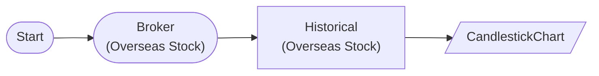

# Candlestick Chart

Display OHLCV candlestick chart with CandlestickChartNode

## Workflow Structure

## Node List

| ID | Type | Description |
|----|------|------|
| start | StartNode | Workflow start |
| broker | OverseasStockBrokerNode | Overseas stock broker connection |
| historical | OverseasStockHistoricalDataNode | Overseas stock historical data query |
| chart | CandlestickChartNode | Candlestick chart |

## Required Credentials

| ID | Type | Description |
|----|------|------|
| broker_cred | broker_ls_overseas_stock | LS Securities Overseas Stock API |

## Data Flow

1. **start** (StartNode) --> **broker** (OverseasStockBrokerNode)
1. **broker** (OverseasStockBrokerNode) --> **historical** (OverseasStockHistoricalDataNode)
1. **historical** (OverseasStockHistoricalDataNode) --> **chart** (CandlestickChartNode)
