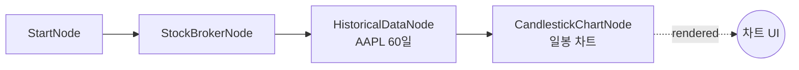

# 25-display-candlestick: 캔들스틱 차트

## 목적
CandlestickChartNode로 OHLCV 캔들스틱 차트를 표시합니다.

## 워크플로우 구조



## 노드 설명

### OverseasStockHistoricalDataNode
- **역할**: 과거 OHLCV 데이터 조회
- **symbol**: `{symbol: "AAPL", exchange: "NASDAQ"}`
- **period**: `1d` (일봉)
- **start_date**: `{{ date.ago(60, format='yyyymmdd') }}` (60일 전)

### CandlestickChartNode
- **역할**: OHLCV 캔들스틱 차트 표시
- **title**: `AAPL 일봉 차트`
- **data**: `{{ nodes.historical.values }}`
- **필드 매핑**:
  - `date_field`: `date`
  - `open_field`: `open`
  - `high_field`: `high`
  - `low_field`: `low`
  - `close_field`: `close`
  - `volume_field`: `volume`

## 필드 매핑

| 설정 | 필수 | 설명 |
|------|------|------|
| `date_field` | O | 날짜/시간 필드 |
| `open_field` | O | 시가 필드 |
| `high_field` | O | 고가 필드 |
| `low_field` | O | 저가 필드 |
| `close_field` | O | 종가 필드 |
| `volume_field` | X | 거래량 필드 (하단 바 차트) |
| `signal_field` | X | 매매 시그널 (마커) |
| `side_field` | X | 포지션 방향 |

## 바인딩 테스트 포인트

| 표현식 | 예상 값 | 설명 |
|--------|---------|------|
| `{{ nodes.historical.values }}` | `[{date, open, high, low, close, volume}, ...]` | OHLCV 데이터 |
| `{{ nodes.chart.rendered }}` | `true` | 렌더링 완료 |

## 실행 결과 예시

### 입력 데이터
```json
{
  "values": [
    {"date": "2025-12-30", "open": 145.0, "high": 148.0, "low": 144.0, "close": 147.5, "volume": 50000000},
    {"date": "2025-12-31", "open": 147.5, "high": 150.0, "low": 146.0, "close": 149.0, "volume": 45000000},
    {"date": "2026-01-02", "open": 149.0, "high": 152.0, "low": 148.5, "close": 151.5, "volume": 55000000}
  ]
}
```

### 차트 렌더링
```
AAPL 일봉 차트
152 ─┬─────────────────────────────────
     │              ┌┐
150 ─┤       ┌┐    ││
     │      ││    │└───── 종가 151.5
148 ─┤      │└──  │
     │   ┌┐│     │
146 ─┤  ││└      │
     │  ││       │
144 ─┤ ─┴┴───────┴─────────────────────
     12/30   12/31   01/02

 Vol ━━━━━━  ━━━━━   ━━━━━━━
```

### JSON 응답
```json
{
  "nodes": {
    "chart": {
      "rendered": true,
      "display_data": {
        "type": "candlestick",
        "title": "AAPL 일봉 차트",
        "data": [
          {"date": "2025-12-30", "open": 145.0, "high": 148.0, "low": 144.0, "close": 147.5, "volume": 50000000},
          ...
        ]
      }
    }
  }
}
```

## 시그널 마커 추가

ConditionNode와 연결하여 매매 시그널을 캔들 위에 표시:

```json
{
  "data": "{{ nodes.condition.values }}",
  "signal_field": "signal"
}
```

### 시그널 포함 데이터
```json
[
  {"date": "2025-12-31", "open": 147.5, "high": 150.0, "low": 146.0, "close": 149.0, "signal": "buy"},
  {"date": "2026-01-10", "open": 155.0, "high": 156.0, "low": 152.0, "close": 153.0, "signal": "sell"}
]
```

## 활용 패턴

### 주간 차트
```json
{
  "period": "1w",
  "title": "AAPL 주봉 차트"
}
```

### 분 차트 (선물)
```json
{
  "type": "OverseasFuturesHistoricalDataNode",
  "period": "1m",
  "title": "NQ 1분 차트"
}
```

## 관련 노드
- `CandlestickChartNode`: display.py
- `OverseasStockHistoricalDataNode`: historical.py
- `ConditionNode`: condition.py (시그널 생성)
