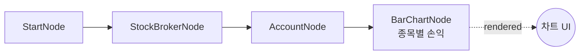

# 26-display-bar-chart: 바 차트 (종목별 손익)

## 목적
BarChartNode로 종목별 손익을 막대 차트로 표시합니다.

## 워크플로우 구조



## 노드 설명

### OverseasStockAccountNode
- **역할**: 계좌 포지션 조회
- **출력**: `positions` (종목별 포지션 정보)

### BarChartNode
- **역할**: 막대 차트 표시
- **title**: `종목별 손익`
- **data**: `{{ nodes.account.positions }}`
- **x_field**: `symbol` (X축: 종목코드)
- **y_field**: `pnl` (Y축: 손익)

## 필드 매핑

| 설정 | 설명 | 예시 |
|------|------|------|
| `x_field` | X축 필드 (카테고리) | `symbol`, `exchange`, `sector` |
| `y_field` | Y축 필드 (값) | `pnl`, `quantity`, `value` |

## 바인딩 테스트 포인트

| 표현식 | 예상 값 | 설명 |
|--------|---------|------|
| `{{ nodes.account.positions }}` | `[{symbol, pnl}, ...]` | 포지션 목록 |
| `{{ nodes.chart.rendered }}` | `true` | 렌더링 완료 |

## 실행 결과 예시

### 입력 데이터
```json
{
  "positions": [
    {"symbol": "AAPL", "exchange": "NASDAQ", "quantity": 50, "pnl": 500.0},
    {"symbol": "MSFT", "exchange": "NASDAQ", "quantity": 20, "pnl": -200.0},
    {"symbol": "NVDA", "exchange": "NASDAQ", "quantity": 10, "pnl": 800.0},
    {"symbol": "TSLA", "exchange": "NASDAQ", "quantity": 5, "pnl": -100.0}
  ]
}
```

### 차트 렌더링
```
종목별 손익

 800 ─┤               ████
      │               ████
 500 ─┤  ████         ████
      │  ████         ████
   0 ─┼──────┬────────────┬─────
      │      │   ████     │
-100 ─┤      │   ████     │  ████
      │      │            │
-200 ─┤      │  ████      │
      └──────┴────────────┴─────
        AAPL  MSFT   NVDA  TSLA
```

### JSON 응답
```json
{
  "nodes": {
    "chart": {
      "rendered": true,
      "display_data": {
        "type": "bar",
        "title": "종목별 손익",
        "x_field": "symbol",
        "y_field": "pnl",
        "data": [
          {"symbol": "AAPL", "pnl": 500.0},
          {"symbol": "MSFT", "pnl": -200.0},
          {"symbol": "NVDA", "pnl": 800.0},
          {"symbol": "TSLA", "pnl": -100.0}
        ]
      }
    }
  }
}
```

## 활용 패턴

### 보유 수량 비교
```json
{
  "x_field": "symbol",
  "y_field": "quantity",
  "title": "종목별 보유 수량"
}
```

### 섹터별 손익
```json
{
  "data": "{{ nodes.account.positions.groupBy('sector').sum('pnl') }}",
  "x_field": "sector",
  "y_field": "pnl",
  "title": "섹터별 손익"
}
```

### 수익 포지션만
```json
{
  "data": "{{ nodes.account.positions.filter('pnl > 0') }}",
  "title": "수익 종목"
}
```

## 색상 처리

- **양수 pnl**: 녹색 (수익)
- **음수 pnl**: 빨간색 (손실)

## 관련 노드
- `BarChartNode`: display.py
- `OverseasStockAccountNode`: account_stock.py
- `TableDisplayNode`: display.py (테이블 표시)
