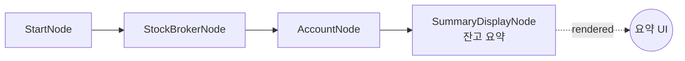

# 27-display-summary: 요약 디스플레이

## 목적
SummaryDisplayNode로 계좌 잔고 또는 JSON 데이터를 요약 형태로 표시합니다.

## 워크플로우 구조



## 노드 설명

### OverseasStockAccountNode
- **역할**: 계좌 정보 조회
- **출력**: `balance` (잔고 정보)

### SummaryDisplayNode
- **역할**: JSON 객체를 요약 형태로 표시
- **title**: `계좌 잔고 요약`
- **data**: `{{ nodes.account.balance }}`

## 바인딩 테스트 포인트

| 표현식 | 예상 값 | 설명 |
|--------|---------|------|
| `{{ nodes.account.balance }}` | `{total, available, ...}` | 잔고 객체 |
| `{{ nodes.summary.rendered }}` | `true` | 렌더링 완료 |

## 실행 결과 예시

### 입력 데이터
```json
{
  "balance": {
    "total": 150000.0,
    "available": 95000.0,
    "used": 55000.0,
    "currency": "USD",
    "margin_ratio": 36.67
  }
}
```

### UI 렌더링
```
┌────────────────────────────────────┐
│ 계좌 잔고 요약                      │
├────────────────────────────────────┤
│ total           │ $150,000.00      │
│ available       │ $95,000.00       │
│ used            │ $55,000.00       │
│ currency        │ USD              │
│ margin_ratio    │ 36.67%           │
└────────────────────────────────────┘
```

### JSON 응답
```json
{
  "nodes": {
    "summary": {
      "rendered": true,
      "display_data": {
        "type": "summary",
        "title": "계좌 잔고 요약",
        "data": {
          "total": 150000.0,
          "available": 95000.0,
          "used": 55000.0,
          "currency": "USD",
          "margin_ratio": 36.67
        }
      }
    }
  }
}
```

## 활용 패턴

### 포트폴리오 성과 요약
```json
{
  "title": "포트폴리오 성과",
  "data": "{{ nodes.portfolio.combined_metrics }}"
}
```

출력:
```
┌────────────────────────────────────┐
│ 포트폴리오 성과                     │
├────────────────────────────────────┤
│ total_return    │ 15.3%            │
│ sharpe_ratio    │ 1.85             │
│ max_drawdown    │ -8.2%            │
│ win_rate        │ 62%              │
└────────────────────────────────────┘
```

### 백테스트 결과 요약
```json
{
  "title": "백테스트 결과",
  "data": "{{ nodes.backtest.summary }}"
}
```

### 주문 결과 요약
```json
{
  "title": "주문 결과",
  "data": "{{ nodes.new_order.order_result }}"
}
```

## 데이터 형식

SummaryDisplayNode는 다양한 데이터 형식을 지원합니다:

| 형식 | 예시 | 표시 방식 |
|------|------|----------|
| 객체 | `{key: value}` | 키-값 테이블 |
| 배열 | `[1, 2, 3]` | 리스트 |
| 숫자 | `12345.67` | 포맷된 숫자 |
| 문자열 | `"Hello"` | 텍스트 |

## 관련 노드
- `SummaryDisplayNode`: display.py
- `OverseasStockAccountNode`: account_stock.py
- `PortfolioNode`: portfolio.py
- `BacktestEngineNode`: analysis.py
