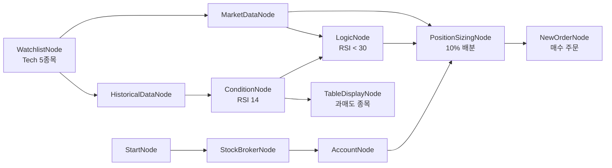

# 28-strategy-rsi-full: RSI 기반 매매 전략 (전체 흐름)

## 목적
Watchlist → Historical → RSI 조건 → LogicNode → PositionSizing → Order → TableDisplay까지 완전한 매매 전략 워크플로우를 테스트합니다.

## 워크플로우 구조



## 워크플로우 단계

### 1. 데이터 수집
- **WatchlistNode**: Tech 5종목 (AAPL, MSFT, NVDA, GOOGL, AMZN)
- **HistoricalDataNode**: 30일 일봉 데이터 (Auto-Iterate)
- **MarketDataNode**: 현재가 조회 (Auto-Iterate)

### 2. 조건 평가
- **ConditionNode (RSI)**: RSI 14일 계산
- **LogicNode**: RSI < 30 (과매도) 조건 검사

### 3. 주문 생성
- **PositionSizingNode**: 잔고의 10% 배분
- **NewOrderNode**: 지정가 매수 주문

### 4. 결과 표시
- **TableDisplayNode**: 과매도 종목 목록

## 바인딩 테스트 포인트

| 표현식 | 설명 |
|--------|------|
| `{{ nodes.watchlist.symbols }}` | 감시 종목 목록 |
| `{{ nodes.historical.values }}` | OHLCV 데이터 |
| `{{ nodes.rsi_condition.result }}` | RSI 조건 결과 |
| `{{ nodes.rsi_condition.result.rsi }}` | RSI 값 |
| `{{ nodes.logic.result }}` | 로직 조건 통과 여부 |
| `{{ nodes.account.balance.available }}` | 주문가능금액 |
| `{{ nodes.sizing.order }}` | 계산된 주문 정보 |
| `{{ nodes.rsi_condition.values.filter('rsi < 30') }}` | 과매도 종목 필터 |

## Auto-Iterate 흐름

```
WatchlistNode (5종목)
     │
     ├─→ HistoricalDataNode (각 종목별 실행)
     │        │
     │        └─→ ConditionNode (RSI 계산)
     │                  │
     │                  └─→ LogicNode (조건 검사)
     │                           │
     └─→ MarketDataNode ────────┘
                │
                └─→ PositionSizingNode → NewOrderNode
```

## 실행 결과 예시

### ConditionNode 출력 (종목별)
```json
{
  "result": {"symbol": "NVDA", "exchange": "NASDAQ", "rsi": 28.5},
  "values": [
    {"date": "2026-01-28", "rsi": 32.1},
    {"date": "2026-01-29", "rsi": 28.5, "signal": "buy"}
  ]
}
```

### LogicNode 출력
```json
{
  "result": {"symbol": "NVDA", "exchange": "NASDAQ", "rsi": 28.5},
  "passed": true
}
```

### PositionSizingNode 출력
```json
{
  "order": {
    "symbol": "NVDA",
    "exchange": "NASDAQ",
    "quantity": 15,
    "price": 650.0
  }
}
```

### TableDisplayNode 출력
```
RSI 과매도 종목
┌─────────┬──────────┬───────┬────────┐
│ symbol  │ exchange │ rsi   │ signal │
├─────────┼──────────┼───────┼────────┤
│ NVDA    │ NASDAQ   │ 28.5  │ buy    │
│ AMZN    │ NASDAQ   │ 29.8  │ buy    │
└─────────┴──────────┴───────┴────────┘
```

## 핵심 바인딩 패턴

### 필터링 후 처리
```json
{
  "data": "{{ nodes.rsi_condition.values.filter('rsi < 30') }}"
}
```

### 메서드 체이닝
```json
{
  "data": "{{ nodes.watchlist.symbols.filter('exchange == \"NASDAQ\"').all() }}"
}
```

### 통계 함수
```json
{
  "avg_rsi": "{{ nodes.rsi_condition.values.avg('rsi') }}"
}
```

## 주의사항

1. **Auto-Iterate**: WatchlistNode에서 시작하는 반복은 최종 노드까지 전파됨
2. **조건 미충족**: LogicNode에서 false인 경우 이후 노드 실행 안 됨
3. **장외 시간**: NewOrderNode는 제출되지만 체결 불가

## 확장 패턴

### MACD 조건 추가
```json
{
  "id": "macd_condition",
  "type": "ConditionNode",
  "plugin": "MACD"
}
```

### 복합 조건 (AND)
```json
{
  "conditions": [
    "{{ nodes.rsi_condition.result.rsi < 30 }}",
    "{{ nodes.macd_condition.result.signal == 'buy' }}"
  ]
}
```

## 관련 노드
- `WatchlistNode`: symbol.py
- `ConditionNode`: condition.py
- `LogicNode`: logic.py
- `PositionSizingNode`: risk.py
- `OverseasStockNewOrderNode`: order.py
- `TableDisplayNode`: display.py
