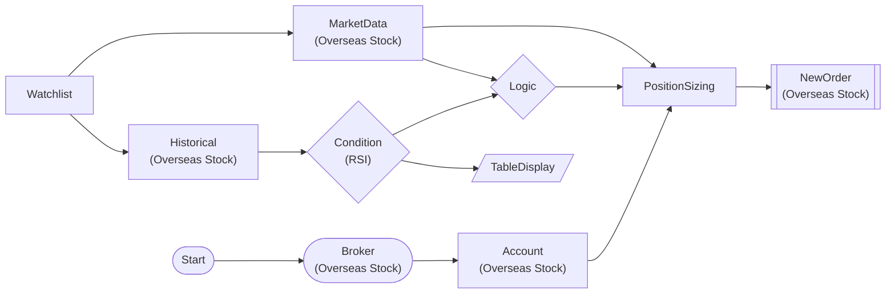

# RSI Trading Strategy (Full Flow)

Full flow from Watchlist → Historical → RSI condition → PositionSizing → Order

## Workflow Structure



## Node List

| ID | Type | Description |
|----|------|------|
| start | StartNode | Workflow start |
| broker | OverseasStockBrokerNode | Overseas stock broker connection |
| account | OverseasStockAccountNode | Overseas stock account balance/position query |
| watchlist | WatchlistNode | Define watchlist symbols |
| historical | OverseasStockHistoricalDataNode | Overseas stock historical data query |
| rsi_condition | ConditionNode | Condition check (plugin-based) |
| market | OverseasStockMarketDataNode | Overseas stock market data query |
| logic | LogicNode | Logic combination (AND/OR/NOT) |
| sizing | PositionSizingNode | Position sizing calculation |
| new_order | OverseasStockNewOrderNode | Overseas stock new order |
| table | TableDisplayNode | Table display output |

## Key Settings

- **watchlist**: AAPL, MSFT, NVDA, GOOGL, AMZN
- **rsi_condition**: Plugin `RSI`
- **rsi_condition**: period=14, threshold=30, direction=below
- **logic**: `` AND ``
- **new_order**: side=`buy`

## Required Credentials

| ID | Type | Description |
|----|------|------|
| broker_cred | broker_ls_overseas_stock | LS Securities Overseas Stock API |

## Data Flow

1. **start** (StartNode) --> **broker** (OverseasStockBrokerNode)
1. **broker** (OverseasStockBrokerNode) --> **account** (OverseasStockAccountNode)
1. **watchlist** (WatchlistNode) --> **historical** (OverseasStockHistoricalDataNode)
1. **watchlist** (WatchlistNode) --> **market** (OverseasStockMarketDataNode)
1. **historical** (OverseasStockHistoricalDataNode) --> **rsi_condition** (ConditionNode)
1. **rsi_condition** (ConditionNode) --> **logic** (LogicNode)
1. **market** (OverseasStockMarketDataNode) --> **logic** (LogicNode)
1. **account** (OverseasStockAccountNode) --> **sizing** (PositionSizingNode)
1. **logic** (LogicNode) --> **sizing** (PositionSizingNode)
1. **market** (OverseasStockMarketDataNode) --> **sizing** (PositionSizingNode)
1. **sizing** (PositionSizingNode) --> **new_order** (OverseasStockNewOrderNode)
1. **rsi_condition** (ConditionNode) --> **table** (TableDisplayNode)

## How to Run

```python
from programgarden import ProgramGarden

pg = ProgramGarden()
job = await pg.run_async(workflow)
```
