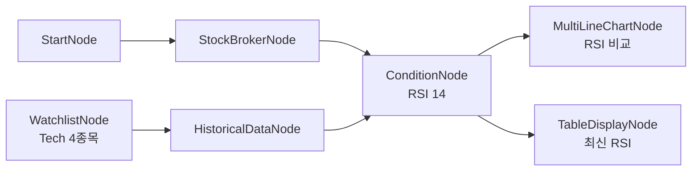

# 29-monitor-multi-rsi: 멀티심볼 RSI 모니터링 + 차트

## 목적
여러 종목의 RSI를 동시에 모니터링하고 MultiLineChart와 Table로 시각화합니다.

## 워크플로우 구조



## 워크플로우 단계

### 1. 종목 선정
- **WatchlistNode**: Tech 4종목 (AAPL, MSFT, NVDA, GOOGL)

### 2. 데이터 수집 (Auto-Iterate)
- **HistoricalDataNode**: 30일 일봉 (각 종목별 실행)

### 3. RSI 계산
- **ConditionNode**: RSI 14일 계산 (각 종목별)

### 4. 시각화 (병렬)
- **MultiLineChartNode**: 종목별 RSI 추이 비교
- **TableDisplayNode**: 최신 RSI 현황 테이블

## 바인딩 테스트 포인트

| 표현식 | 설명 |
|--------|------|
| `{{ nodes.watchlist.symbols }}` | 감시 종목 목록 |
| `{{ nodes.rsi_condition.values }}` | 종목별 RSI 시계열 |
| `{{ nodes.rsi_condition.result }}` | 종목별 최신 RSI |
| `{{ lst.flatten(..., 'time_series') }}` | 평탄화된 시계열 |
| `{{ nodes.rsi_condition.result.all() }}` | 모든 종목 최신 RSI |

## lst.flatten 상세

### 입력 (종목별 분리)
```json
[
  {
    "symbol": "AAPL",
    "exchange": "NASDAQ",
    "time_series": [
      {"date": "01-28", "rsi": 45.2},
      {"date": "01-29", "rsi": 42.1}
    ]
  },
  {
    "symbol": "MSFT",
    "exchange": "NASDAQ",
    "time_series": [
      {"date": "01-28", "rsi": 52.3},
      {"date": "01-29", "rsi": 55.8}
    ]
  }
]
```

### 출력 (평탄화)
```json
[
  {"symbol": "AAPL", "exchange": "NASDAQ", "date": "01-28", "rsi": 45.2},
  {"symbol": "AAPL", "exchange": "NASDAQ", "date": "01-29", "rsi": 42.1},
  {"symbol": "MSFT", "exchange": "NASDAQ", "date": "01-28", "rsi": 52.3},
  {"symbol": "MSFT", "exchange": "NASDAQ", "date": "01-29", "rsi": 55.8}
]
```

## 실행 결과 예시

### MultiLineChartNode
```
Tech 종목 RSI 비교
100 ─┬─────────────────────────────────
     │ ─── AAPL   ─── MSFT
 70 ─┼─ ─── NVDA   ─── GOOGL ─ ─ ─ ─ ─
     │
 50 ─┤    ────────         ──────────
     │  ────        ────  ────
 30 ─┼─ ─ ─ ─ ─ ─────── ─ ─ ─ ─ ─ ─ ─
     │               ▲ buy
  0 ─┴─────────────────────────────────
     01/01    01/15    01/29
```

### TableDisplayNode
```
최신 RSI 현황
┌─────────┬──────────┬───────┬────────┐
│ symbol  │ exchange │ rsi   │ signal │
├─────────┼──────────┼───────┼────────┤
│ NVDA    │ NASDAQ   │ 28.5  │ buy    │
│ AAPL    │ NASDAQ   │ 42.1  │ null   │
│ MSFT    │ NASDAQ   │ 55.8  │ null   │
│ GOOGL   │ NASDAQ   │ 61.2  │ null   │
└─────────┴──────────┴───────┴────────┘
```

## Auto-Iterate 흐름

```
WatchlistNode
     │
     │ symbols: [AAPL, MSFT, NVDA, GOOGL]
     │
     ▼
HistoricalDataNode (4회 실행)
     │
     │ iteration 0: AAPL → values: [...]
     │ iteration 1: MSFT → values: [...]
     │ iteration 2: NVDA → values: [...]
     │ iteration 3: GOOGL → values: [...]
     │
     ▼
ConditionNode (4회 실행)
     │
     │ 각 종목별 RSI 계산
     │
     ├─→ MultiLineChartNode (집계 후 1회)
     │        └─ lst.flatten으로 모든 데이터 결합
     │
     └─→ TableDisplayNode (집계 후 1회)
              └─ result.all()로 최신 RSI만 추출
```

## 핵심 패턴

### 시계열 데이터 비교
```json
{
  "data": "{{ lst.flatten(nodes.condition.values, 'time_series') }}",
  "series_key": "symbol"
}
```

### 최신 값만 테이블
```json
{
  "data": "{{ nodes.condition.result.all() }}"
}
```

### 조건 필터링
```json
{
  "data": "{{ nodes.rsi_condition.result.filter('rsi < 30').all() }}"
}
```

## 활용 패턴

### 과매도/과매수 영역 강조
차트에서 RSI 30 이하, 70 이상 영역 표시

### 알림 연동
```json
{
  "id": "alert",
  "type": "LogicNode",
  "conditions": ["{{ nodes.rsi_condition.result.filter('rsi < 30').count() > 0 }}"]
}
```

### 실시간 모니터링
ScheduleNode와 연결하여 주기적 실행:
```json
{
  "id": "schedule",
  "type": "ScheduleNode",
  "cron": "*/5 * * * 1-5"
}
```

## 관련 노드
- `WatchlistNode`: symbol.py
- `ConditionNode`: condition.py
- `MultiLineChartNode`: display.py
- `TableDisplayNode`: display.py
