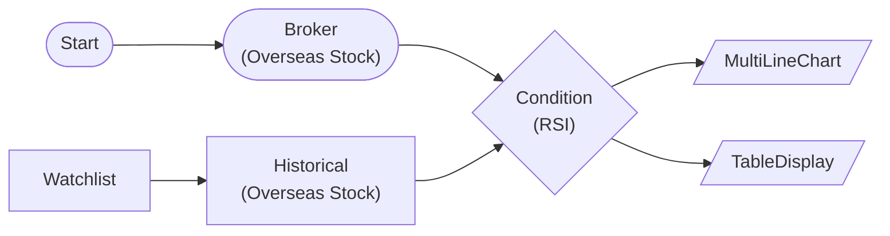

# Multi-Symbol RSI Monitoring + Chart

Watchlist → Historical → RSI → MultiLineChart + Table

## Workflow Structure

## Node List

| ID | Type | Description |
|----|------|------|
| start | StartNode | Workflow start |
| broker | OverseasStockBrokerNode | Overseas stock broker connection |
| watchlist | WatchlistNode | Define watchlist symbols |
| historical | OverseasStockHistoricalDataNode | Overseas stock historical data query |
| rsi_condition | ConditionNode | Condition check (plugin-based) |
| chart | MultiLineChartNode | Multi-line chart |
| table | TableDisplayNode | Table display output |

## Key Settings

- **watchlist**: AAPL, MSFT, NVDA, GOOGL
- **rsi_condition**: Plugin `RSI`
- **rsi_condition**: period=14, threshold=30, direction=below

## Required Credentials

| ID | Type | Description |
|----|------|------|
| broker_cred | broker_ls_overseas_stock | LS Securities Overseas Stock API |

## Data Flow

1. **start** (StartNode) --> **broker** (OverseasStockBrokerNode)
1. **watchlist** (WatchlistNode) --> **historical** (OverseasStockHistoricalDataNode)
1. **broker** (OverseasStockBrokerNode) --> **rsi_condition** (ConditionNode)
1. **historical** (OverseasStockHistoricalDataNode) --> **rsi_condition** (ConditionNode)
1. **rsi_condition** (ConditionNode) --> **chart** (MultiLineChartNode)
1. **rsi_condition** (ConditionNode) --> **table** (TableDisplayNode)
