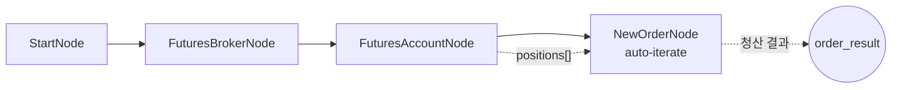

# 30-liquidate-futures-positions: 해외선물 포지션 전량 청산

## 목적
보유 중인 해외선물 포지션을 auto-iterate를 활용하여 전량 청산합니다.

> **주의**: HKEX 모의투자에서는 시장가 주문이 불가하여 지정가를 사용합니다.

## 워크플로우 구조



## 핵심 개념: Auto-Iterate

AccountNode가 positions 배열을 출력하면, NewOrderNode가 자동으로 각 포지션에 대해 반복 실행됩니다.

```
[AccountNode]           [NewOrderNode]
positions: [            auto-iterate:
  {symbol: "HMCEG26",     [1/2] HMCEG26 → sell 3
   direction: "long",     [2/2] HMHG26 → buy 1
   close_side: "sell",
   quantity: 3},
  {symbol: "HMHG26",
   direction: "short",
   close_side: "buy",
   quantity: 1}
]
```

## 노드 설명

### OverseasFuturesAccountNode
- **역할**: 해외선물 계좌 정보 및 포지션 조회
- **출력 필드**:

| 필드 | 설명 |
|------|------|
| `positions[].symbol` | 종목코드 |
| `positions[].exchange` | 거래소 |
| `positions[].direction` | 포지션 방향 (long/short) |
| `positions[].close_side` | 청산 주문 방향 (sell/buy) |
| `positions[].quantity` | 보유 수량 |
| `positions[].current_price` | 현재가 |

### OverseasFuturesNewOrderNode (청산용)
- **역할**: 포지션 청산 주문 실행
- **side**: `{{ item.close_side }}` - 포지션 반대 방향
- **order_type**: `limit` (HKEX 모의투자는 시장가 불가)
- **order**:
  - `symbol`: `{{ item.symbol }}`
  - `exchange`: `{{ item.exchange }}`
  - `quantity`: `{{ item.quantity }}`
  - `price`: `{{ item.current_price }}`

## 바인딩 표현식

| 표현식 | 설명 | 예시 값 |
|--------|------|---------|
| `{{ item.symbol }}` | 현재 반복 종목 | `"HMCEG26"` |
| `{{ item.close_side }}` | 청산 방향 | `"sell"` (long→sell) |
| `{{ item.quantity }}` | 보유 수량 | `3` |
| `{{ item.current_price }}` | 현재가 | `9350.0` |
| `{{ index }}` | 현재 인덱스 | `0` |
| `{{ total }}` | 전체 개수 | `2` |

## 실행 결과 예시

### 청산 성공
```json
{
  "nodes": {
    "account": {
      "positions": [
        {"symbol": "HMCEG26", "direction": "long", "close_side": "sell", "quantity": 3},
        {"symbol": "HMHG26", "direction": "short", "close_side": "buy", "quantity": 1}
      ]
    },
    "close_order": {
      "order_result": [
        {"success": true, "symbol": "HMCEG26", "side": "sell", "order_id": "863"},
        {"success": true, "symbol": "HMHG26", "side": "buy", "order_id": "864"}
      ]
    }
  }
}
```

## 청산 로직

| 보유 포지션 | direction | close_side | 청산 주문 |
|------------|-----------|------------|----------|
| 매수 포지션 | `long` | `sell` | 매도 주문 |
| 매도 포지션 | `short` | `buy` | 매수 주문 |

## 주의사항

1. **HKEX 모의투자**: 시장가 주문 불가 → 지정가 사용
2. **FutsOrdTpCode**: 청산도 "1" (신규주문)으로 처리 - 반대 방향 신규주문이 청산임
3. **포지션 없음**: positions가 빈 배열이면 close_order 노드는 실행되지 않음

## 관련 노드
- `OverseasFuturesNewOrderNode`: order.py
- `OverseasFuturesBrokerNode`: infra.py
- `OverseasFuturesAccountNode`: account_futures.py
