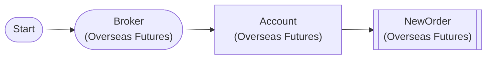

# Overseas Futures Full Position Liquidation

Liquidate all overseas futures positions (paper trading) - using auto-iterate, HKEX requires limit order (market order not supported)

## Workflow Structure



## Node List

| ID | Type | Description |
|----|------|------|
| start | StartNode | Workflow start |
| broker | OverseasFuturesBrokerNode | Overseas futures broker connection (paper trading, HKEX) |
| account | OverseasFuturesAccountNode | Overseas futures account balance/position query |
| close_order | OverseasFuturesNewOrderNode | Overseas futures new order |

## Key Settings

- **broker**: Paper trading mode
- **close_order**: side=`{{ item.close_side }}`

## Required Credentials

| ID | Type | Description |
|----|------|------|
| futures_cred | broker_ls_overseas_futures | LS Securities Overseas Futures API (paper trading, HKEX only) |

## Data Flow

1. **start** (StartNode) --> **broker** (OverseasFuturesBrokerNode)
1. **broker** (OverseasFuturesBrokerNode) --> **account** (OverseasFuturesAccountNode)
1. **account** (OverseasFuturesAccountNode) --> **close_order** (OverseasFuturesNewOrderNode)

## How to Run

```python
from programgarden import ProgramGarden

pg = ProgramGarden()
job = await pg.run_async(workflow)
```
