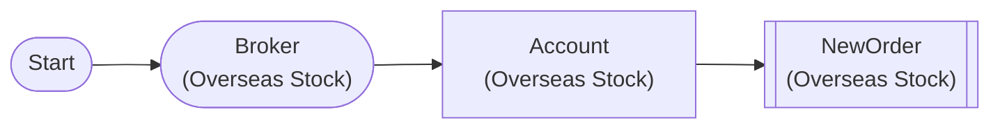

# Overseas Stock Full Position Liquidation

Liquidate all overseas stock positions (live) - market order available for selling

## Workflow Structure



## Node List

| ID | Type | Description |
|----|------|------|
| start | StartNode | Workflow start |
| broker | OverseasStockBrokerNode | Overseas stock broker connection |
| account | OverseasStockAccountNode | Overseas stock account balance/position query |
| close_order | OverseasStockNewOrderNode | Overseas stock new order |

## Key Settings

- **close_order**: side=`{{ item.close_side }}`

## Required Credentials

| ID | Type | Description |
|----|------|------|
| broker_cred | broker_ls_overseas_stock | LS Securities Overseas Stock API |

## Data Flow

1. **start** (StartNode) --> **broker** (OverseasStockBrokerNode)
1. **broker** (OverseasStockBrokerNode) --> **account** (OverseasStockAccountNode)
1. **account** (OverseasStockAccountNode) --> **close_order** (OverseasStockNewOrderNode)

## How to Run

```python
from programgarden import ProgramGarden

pg = ProgramGarden()
job = await pg.run_async(workflow)
```
