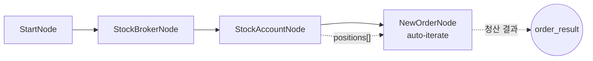

# 31-liquidate-stock-positions: 해외주식 포지션 전량 청산

## 목적
보유 중인 해외주식 포지션을 auto-iterate를 활용하여 전량 청산합니다.

> **참고**: 해외주식 매도는 시장가 주문이 가능합니다. 단, 장외 시간에는 지정가만 가능합니다.

## 워크플로우 구조



## 핵심 개념: Auto-Iterate

AccountNode가 positions 배열을 출력하면, NewOrderNode가 자동으로 각 포지션에 대해 반복 실행됩니다.

```
[AccountNode]           [NewOrderNode]
positions: [            auto-iterate:
  {symbol: "GOSS",        [1/1] GOSS → sell 5
   direction: "long",
   close_side: "sell",
   quantity: 5}
]
```

## 노드 설명

### OverseasStockAccountNode
- **역할**: 해외주식 계좌 정보 및 보유 종목 조회
- **출력 필드**:

| 필드 | 설명 |
|------|------|
| `positions[].symbol` | 종목코드 |
| `positions[].exchange` | 거래소 (NASDAQ, NYSE 등) |
| `positions[].direction` | 포지션 방향 (주식은 항상 long) |
| `positions[].close_side` | 청산 주문 방향 (주식은 항상 sell) |
| `positions[].quantity` | 보유 수량 |
| `positions[].current_price` | 현재가 |

### OverseasStockNewOrderNode (청산용)
- **역할**: 보유 주식 매도 주문 실행
- **side**: `{{ item.close_side }}` → 항상 `sell`
- **order_type**: `market` (시장가, 장중에만 가능)
- **order**:
  - `symbol`: `{{ item.symbol }}`
  - `exchange`: `{{ item.exchange }}`
  - `quantity`: `{{ item.quantity }}`

## 해외주식 주문 규칙

| side | order_type | 가능 여부 | 비고 |
|------|------------|----------|------|
| `buy` | `market` | X | 지정가로 자동 변환 |
| `buy` | `limit` | O | 가격 0이면 현재가 자동 조회 |
| `sell` | `market` | O | 장중에만 가능 |
| `sell` | `limit` | O | 항상 가능 |

## 바인딩 표현식

| 표현식 | 설명 | 예시 값 |
|--------|------|---------|
| `{{ item.symbol }}` | 현재 반복 종목 | `"GOSS"` |
| `{{ item.close_side }}` | 청산 방향 | `"sell"` |
| `{{ item.quantity }}` | 보유 수량 | `5` |
| `{{ item.exchange }}` | 거래소 | `"NASDAQ"` |

## 실행 결과 예시

### 장중 (체결 가능)
```json
{
  "nodes": {
    "close_order": {
      "order_result": {
        "success": true,
        "symbol": "GOSS",
        "exchange": "NASDAQ",
        "side": "sell",
        "quantity": 5,
        "price": 0.0,
        "status": "submitted"
      },
      "order_id": "12345"
    }
  }
}
```

### 장외 (경고)
```json
{
  "nodes": {
    "close_order": {
      "order_result": {
        "success": true,
        "symbol": "GOSS",
        "side": "sell",
        "quantity": 5,
        "status": "submitted"
      },
      "order_id": ""
    }
  }
}
```
로그: `[warning] Order warning: GOSS - 주간거래는 지정가로만 주문이 가능합니다.`

## 지정가 청산 (장외용)

장외 시간에 청산하려면 지정가를 사용하세요:

```json
{
  "id": "close_order",
  "type": "OverseasStockNewOrderNode",
  "side": "{{ item.close_side }}",
  "order_type": "limit",
  "order": {
    "symbol": "{{ item.symbol }}",
    "exchange": "{{ item.exchange }}",
    "quantity": "{{ item.quantity }}",
    "price": "{{ item.current_price }}"
  }
}
```

## 거래 시간 (한국시간)

| 거래소 | 정규장 | 주간거래 |
|--------|--------|---------|
| NASDAQ/NYSE | 23:30 ~ 06:00 | 18:00 ~ 08:00 |
| 서머타임 | 22:30 ~ 05:00 | 17:00 ~ 07:00 |

## 관련 노드
- `OverseasStockNewOrderNode`: order.py
- `OverseasStockBrokerNode`: infra.py
- `OverseasStockAccountNode`: account_stock.py
