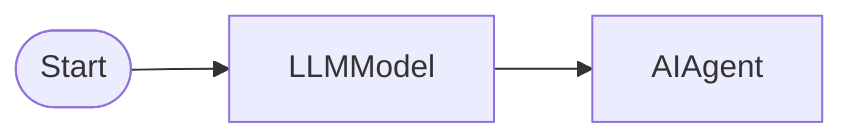

# AI Agent Basic (Text Response)

LLMModelNode → AIAgentNode minimal setup. Text response only, no tools

## Workflow Structure

## Node List

| ID | Type | Description |
|----|------|------|
| start | StartNode | Workflow start |
| llm | LLMModelNode | LLM model connection |
| agent | AIAgentNode | AI agent (tool-based analysis) |

## Key Settings

- **agent**: preset=`custom`

## Required Credentials

| ID | Type | Description |
|----|------|------|
| llm_cred | llm_anthropic | Anthropic Claude API |

## Data Flow

1. **start** (StartNode) --> **llm** (LLMModelNode)
1. **llm** (LLMModelNode) --> **agent** (AIAgentNode)
