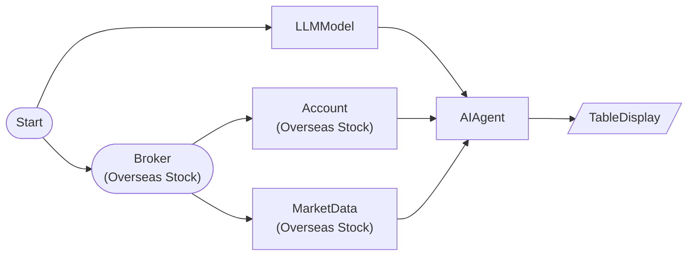

# AI Risk Manager (Account Analysis)

Query account positions as tool with risk_manager preset and evaluate risk

## Workflow Structure



## Node List

| ID | Type | Description |
|----|------|------|
| start | StartNode | Workflow start |
| broker | OverseasStockBrokerNode | Overseas stock broker connection |
| llm | LLMModelNode | LLM model connection |
| account | OverseasStockAccountNode | Overseas stock account balance/position query |
| market | OverseasStockMarketDataNode | Overseas stock market data query |
| agent | AIAgentNode | AI agent (tool-based analysis) |
| table | TableDisplayNode | Table display output |

## Key Settings

- **market**: AAPL, TSLA, NVDA
- **agent**: preset=`risk_manager`

## Required Credentials

| ID | Type | Description |
|----|------|------|
| broker_cred | broker_ls_overseas_stock | LS Securities Overseas Stock API |
| llm_cred | llm_anthropic | Anthropic Claude API |

## Data Flow

1. **start** (StartNode) --> **broker** (OverseasStockBrokerNode)
1. **start** (StartNode) --> **llm** (LLMModelNode)
1. **broker** (OverseasStockBrokerNode) --> **account** (OverseasStockAccountNode)
1. **broker** (OverseasStockBrokerNode) --> **market** (OverseasStockMarketDataNode)
1. **llm** (LLMModelNode) --> **agent** (AIAgentNode)
1. **account** (OverseasStockAccountNode) --> **agent** (AIAgentNode)
1. **market** (OverseasStockMarketDataNode) --> **agent** (AIAgentNode)
1. **agent** (AIAgentNode) --> **table** (TableDisplayNode)

## How to Run

```python
from programgarden import ProgramGarden

pg = ProgramGarden()
job = await pg.run_async(workflow)
```
