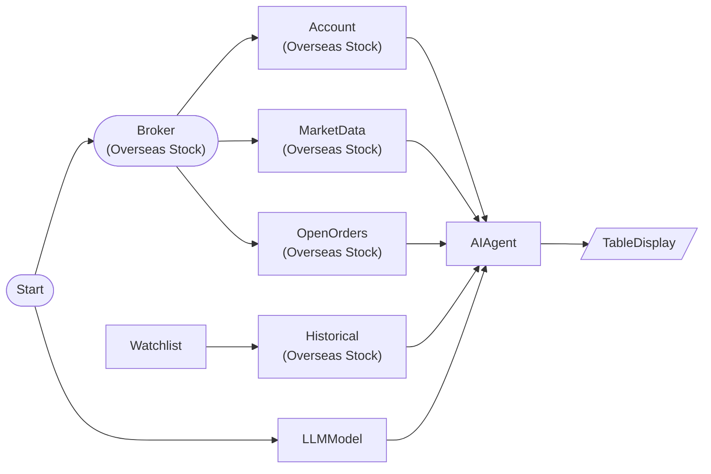

# AI Strategist (Comprehensive Analysis)

Comprehensive analysis of account/market/historical data with strategist preset for trading decisions

## Workflow Structure

## Node List

| ID | Type | Description |
|----|------|------|
| start | StartNode | Workflow start |
| broker | OverseasStockBrokerNode | Overseas stock broker connection |
| llm | LLMModelNode | LLM model connection |
| account | OverseasStockAccountNode | Overseas stock account balance/position query |
| watchlist | WatchlistNode | Define watchlist symbols |
| market | OverseasStockMarketDataNode | Overseas stock market data query |
| historical | OverseasStockHistoricalDataNode | Overseas stock historical data query |
| open_orders | OverseasStockOpenOrdersNode | Overseas stock open orders query |
| agent | AIAgentNode | AI agent (tool-based analysis) |
| result_table | TableDisplayNode | Table display output |

## Key Settings

- **watchlist**: AAPL, MSFT, NVDA, TSLA
- **market**: AAPL, MSFT, NVDA, TSLA
- **agent**: preset=`strategist`

## Required Credentials

| ID | Type | Description |
|----|------|------|
| broker_cred | broker_ls_overseas_stock | LS Securities Overseas Stock API |
| llm_cred | llm_anthropic | Anthropic Claude API |

## Data Flow

1. **start** (StartNode) --> **broker** (OverseasStockBrokerNode)
1. **start** (StartNode) --> **llm** (LLMModelNode)
1. **broker** (OverseasStockBrokerNode) --> **account** (OverseasStockAccountNode)
1. **broker** (OverseasStockBrokerNode) --> **market** (OverseasStockMarketDataNode)
1. **broker** (OverseasStockBrokerNode) --> **open_orders** (OverseasStockOpenOrdersNode)
1. **watchlist** (WatchlistNode) --> **historical** (OverseasStockHistoricalDataNode)
1. **llm** (LLMModelNode) --> **agent** (AIAgentNode)
1. **account** (OverseasStockAccountNode) --> **agent** (AIAgentNode)
1. **market** (OverseasStockMarketDataNode) --> **agent** (AIAgentNode)
1. **historical** (OverseasStockHistoricalDataNode) --> **agent** (AIAgentNode)
1. **open_orders** (OverseasStockOpenOrdersNode) --> **agent** (AIAgentNode)
1. **agent** (AIAgentNode) --> **result_table** (TableDisplayNode)
