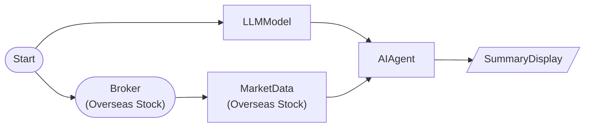

# AI Agent JSON Output Test

Workflow receiving free-form JSON response with output_format=json

## Workflow Structure



## Node List

| ID | Type | Description |
|----|------|------|
| start | StartNode | Workflow start |
| llm | LLMModelNode | LLM model connection |
| broker | OverseasStockBrokerNode | Overseas stock broker connection |
| market | OverseasStockMarketDataNode | Overseas stock market data query |
| agent | AIAgentNode | AI agent (tool-based analysis) |
| summary | SummaryDisplayNode | Summary dashboard |

## Key Settings

- **market**: AAPL, NVDA
- **agent**: preset=`custom`

## Required Credentials

| ID | Type | Description |
|----|------|------|
| broker_cred | broker_ls_overseas_stock | LS Securities Overseas Stock API |
| llm_cred | llm_anthropic | Anthropic Claude API |

## Data Flow

1. **start** (StartNode) --> **llm** (LLMModelNode)
1. **start** (StartNode) --> **broker** (OverseasStockBrokerNode)
1. **broker** (OverseasStockBrokerNode) --> **market** (OverseasStockMarketDataNode)
1. **llm** (LLMModelNode) --> **agent** (AIAgentNode)
1. **market** (OverseasStockMarketDataNode) --> **agent** (AIAgentNode)
1. **agent** (AIAgentNode) --> **summary** (SummaryDisplayNode)

## How to Run

```python
from programgarden import ProgramGarden

pg = ProgramGarden()
job = await pg.run_async(workflow)
```
