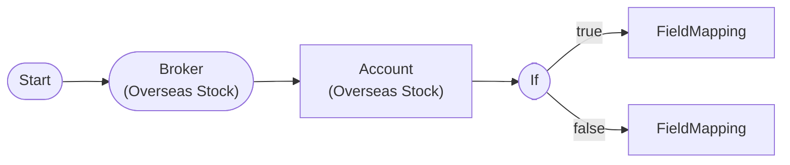

# Balance Check with Order Eligibility Branch

IfNode branch based on orderable_amount after AccountNode balance query. Validates extended balance fields (orderable_amount, foreign_cash, exchange_rate).

## Workflow Structure

## Node List

| ID | Type | Description |
|----|------|------|
| start | StartNode | Workflow start |
| broker | OverseasStockBrokerNode | Overseas stock broker connection |
| account | OverseasStockAccountNode | Overseas stock account balance/position query |
| check_orderable | IfNode | Conditional branch (if/else) |
| can_order | FieldMappingNode | Field mapping/transformation |
| insufficient | FieldMappingNode | Field mapping/transformation |

## Key Settings

- **check_orderable**: `{{ nodes.account.balance.orderable_amount }}` >= `100`

## Required Credentials

| ID | Type | Description |
|----|------|------|
| broker_cred | broker_ls_overseas_stock | LS Securities Overseas Stock API |

## Data Flow

1. **start** (StartNode) --> **broker** (OverseasStockBrokerNode)
1. **broker** (OverseasStockBrokerNode) --> **account** (OverseasStockAccountNode)
1. **account** (OverseasStockAccountNode) --> **check_orderable** (IfNode)
1. **check_orderable** (IfNode) --true--> **can_order** (FieldMappingNode)
1. **check_orderable** (IfNode) --false--> **insufficient** (FieldMappingNode)
