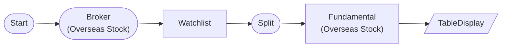

# Overseas Stock Fundamental Data Test

Query AAPL, MSFT fundamental data (PER, EPS, market cap, etc.) with OverseasStockFundamentalNode.

## Workflow Structure

## Node List

| ID | Type | Description |
|----|------|------|
| start | StartNode | Workflow start |
| broker | OverseasStockBrokerNode | Overseas stock broker connection |
| watchlist | WatchlistNode | Define watchlist symbols |
| split | SplitNode | Data split |
| fundamental | OverseasStockFundamentalNode | Overseas stock fundamental data |
| display | TableDisplayNode | Table display output |

## Key Settings

- **watchlist**: AAPL, MSFT

## Required Credentials

| ID | Type | Description |
|----|------|------|
| broker_cred | broker_ls_overseas_stock | LS Securities Overseas Stock API |

## Data Flow

1. **start** (StartNode) --> **broker** (OverseasStockBrokerNode)
1. **broker** (OverseasStockBrokerNode) --> **watchlist** (WatchlistNode)
1. **watchlist** (WatchlistNode) --> **split** (SplitNode)
1. **split** (SplitNode) --> **fundamental** (OverseasStockFundamentalNode)
1. **fundamental** (OverseasStockFundamentalNode) --> **display** (TableDisplayNode)
