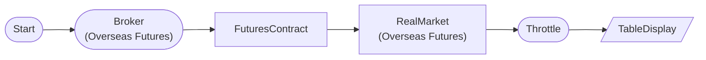

# Overseas Futures Real-time Tick (Paper Trading)

해외선물 모의투자 모드에서 실시간 OVC 틱 데이터 수신을 확인하는 워크플로우입니다. 종목코드를 직접 적지 않고 **FuturesContractNode** 가 기초자산(HMCE = 미니 H주)의 **현재 상장 월물을 실행 시점에 근월물로 자동 해소**하므로, 만기가 지나도 워크플로우가 멈추지 않고 다음 월물로 넘어갑니다. 모의투자는 홍콩거래소(HKEX)만 지원합니다.

## Workflow Structure

## Node List

| ID | Type | Description |
|----|------|------|
| start | StartNode | Workflow start |
| broker | OverseasFuturesBrokerNode | Overseas futures broker connection (paper trading, HKEX) |
| contract | FuturesContractNode | Resolve the currently listed contract from the underlying product code |
| realtime | OverseasFuturesRealMarketDataNode | Overseas futures real-time market data |
| throttle | ThrottleNode | Execution rate limiting |
| display | TableDisplayNode | Table display output |

## Key Settings

- **broker**: Paper trading mode
- **contract**: `base_products: ["HMCE"]` (미니 H주), `contract_selection: "front"` (근월물), `futures_exchange: "HKEX"` — 실행할 때마다 LS 종목마스터(o3101)를 조회해 현재 상장된 근월물 종목코드로 해소합니다. 월물 코드는 저장하지 않습니다.
- **realtime**: `symbol: "{{ item }}"` — contract 가 내보내는 종목을 한 건씩 auto-iterate 로 받습니다.

## Required Credentials

| ID | Type | Description |
|----|------|------|
| futures_cred | broker_ls_overseas_futures | LS Securities Overseas Futures API (paper trading, HKEX only) |

## Data Flow

1. **start** (StartNode) --> **broker** (OverseasFuturesBrokerNode)
1. **broker** (OverseasFuturesBrokerNode) --> **contract** (FuturesContractNode)
1. **contract** (FuturesContractNode) --> **realtime** (OverseasFuturesRealMarketDataNode)
1. **realtime** (OverseasFuturesRealMarketDataNode) --> **throttle** (ThrottleNode)
1. **throttle** (ThrottleNode) --> **display** (TableDisplayNode)
