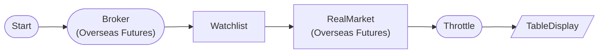

# Overseas Futures Real-time Tick (Paper Trading)

Verify real-time OVC tick data reception in overseas futures paper trading mode. Subscribe to HKEX Hang Seng Index futures Feb contract (HMCEG26). Paper trading supports HKEX only.

## Workflow Structure



## Node List

| ID | Type | Description |
|----|------|------|
| start | StartNode | Workflow start |
| broker | OverseasFuturesBrokerNode | Overseas futures broker connection (paper trading, HKEX) |
| watchlist | WatchlistNode | Define watchlist symbols |
| realtime | OverseasFuturesRealMarketDataNode | Overseas futures real-time market data |
| throttle | ThrottleNode | Execution rate limiting |
| display | TableDisplayNode | Table display output |

## Key Settings

- **broker**: Paper trading mode
- **watchlist**: HMCEG26

## Required Credentials

| ID | Type | Description |
|----|------|------|
| futures_cred | broker_ls_overseas_futures | LS Securities Overseas Futures API (paper trading, HKEX only) |

## Data Flow

1. **start** (StartNode) --> **broker** (OverseasFuturesBrokerNode)
1. **broker** (OverseasFuturesBrokerNode) --> **watchlist** (WatchlistNode)
1. **watchlist** (WatchlistNode) --> **realtime** (OverseasFuturesRealMarketDataNode)
1. **realtime** (OverseasFuturesRealMarketDataNode) --> **throttle** (ThrottleNode)
1. **throttle** (ThrottleNode) --> **display** (TableDisplayNode)

## How to Run

```python
from programgarden import ProgramGarden

pg = ProgramGarden()
job = await pg.run_async(workflow)
```
