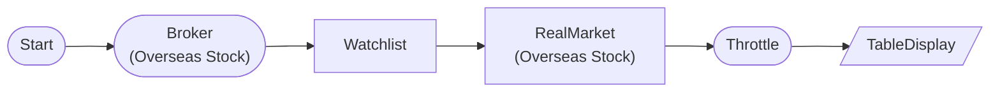

# Overseas Stock Real-time Tick (Live)

Verify overseas stock real-time GSC tick data reception. Subscribe to AAPL (NASDAQ). Note: Real-time overseas stock does not support paper trading (LS Securities API limitation), live only.

## Workflow Structure



## Node List

| ID | Type | Description |
|----|------|------|
| start | StartNode | Workflow start |
| broker | OverseasStockBrokerNode | Overseas stock broker connection |
| watchlist | WatchlistNode | Define watchlist symbols |
| realtime | OverseasStockRealMarketDataNode | Overseas stock real-time market data |
| throttle | ThrottleNode | Execution rate limiting |
| display | TableDisplayNode | Table display output |

## Key Settings

- **watchlist**: AAPL

## Required Credentials

| ID | Type | Description |
|----|------|------|
| broker_cred | broker_ls_overseas_stock | LS Securities Overseas Stock API |

## Data Flow

1. **start** (StartNode) --> **broker** (OverseasStockBrokerNode)
1. **broker** (OverseasStockBrokerNode) --> **watchlist** (WatchlistNode)
1. **watchlist** (WatchlistNode) --> **realtime** (OverseasStockRealMarketDataNode)
1. **realtime** (OverseasStockRealMarketDataNode) --> **throttle** (ThrottleNode)
1. **throttle** (ThrottleNode) --> **display** (TableDisplayNode)

## How to Run

```python
from programgarden import ProgramGarden

pg = ProgramGarden()
job = await pg.run_async(workflow)
```
