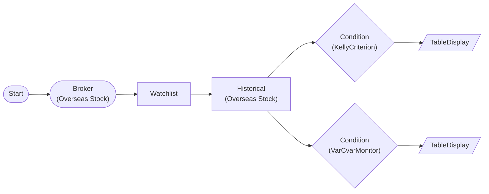

# Quant Risk Management Plugin Workflow (per-symbol)

KellyCriterion + VarCvarMonitor workflow. WatchlistNode → HistoricalDataNode(auto-iterate) → ConditionNode(items) pattern. Multi-symbol plugins (RiskParity, CorrelationGuard, BetaHedge) are incompatible with ConditionNode auto-iterate, tested via NodeRunner+direct call in test_quant_risk_api.py.

> ## Quant Risk Management Plugin (Per-Symbol)
KellyCriterion + VarCvarMonitor: ConditionNode auto-iterate compatible

**Multi-symbol plugins** (RiskParity, CorrelationGuard, BetaHedge):
Incompatible with ConditionNode auto-iterate → NodeRunner + direct

## Workflow Structure

## Node List

| ID | Type | Description |
|----|------|------|
| start | StartNode | Workflow start |
| broker | OverseasStockBrokerNode | Overseas stock broker connection |
| watchlist | WatchlistNode | Define watchlist symbols |
| historical | OverseasStockHistoricalDataNode | Overseas stock historical data query |
| kelly | ConditionNode | Condition check (plugin-based) |
| var_monitor | ConditionNode | Condition check (plugin-based) |
| kelly_table | TableDisplayNode | Table display output |
| var_table | TableDisplayNode | Table display output |

## Key Settings

- **watchlist**: AAPL, MSFT, SPY
- **kelly**: Plugin `KellyCriterion`
- **kelly**: lookback=60, kelly_fraction=0.25, min_position_pct=2.0, max_position_pct=25.0
- **var_monitor**: Plugin `VarCvarMonitor`
- **var_monitor**: lookback=60, confidence_level=95.0, var_method=historical, time_horizon=1

## Required Credentials

| ID | Type | Description |
|----|------|------|
| broker_cred | broker_ls_overseas_stock | LS Securities Overseas Stock API |

## Data Flow

1. **start** (StartNode) --> **broker** (OverseasStockBrokerNode)
1. **broker** (OverseasStockBrokerNode) --> **watchlist** (WatchlistNode)
1. **watchlist** (WatchlistNode) --> **historical** (OverseasStockHistoricalDataNode)
1. **historical** (OverseasStockHistoricalDataNode) --> **kelly** (ConditionNode)
1. **historical** (OverseasStockHistoricalDataNode) --> **var_monitor** (ConditionNode)
1. **kelly** (ConditionNode) --> **kelly_table** (TableDisplayNode)
1. **var_monitor** (ConditionNode) --> **var_table** (TableDisplayNode)
