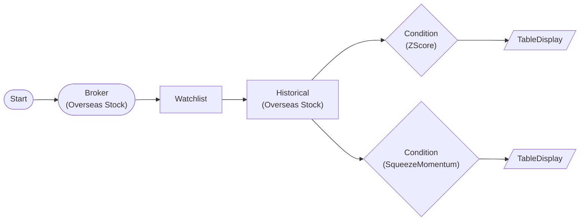

# Tier1 ZScore + SqueezeMomentum Workflow

Test ZScore and SqueezeMomentum plugins with live LS Securities API data. WatchlistNode → HistoricalDataNode(auto-iterate) → ConditionNode(items) pattern.

> ## Tier 1 - ZScore + SqueezeMomentum
ZScore: Standard deviation normalized oversold/overbought
SqueezeMomentum: BB+KC squeeze fire + linear regression momentum

## Workflow Structure



## Node List

| ID | Type | Description |
|----|------|------|
| start | StartNode | Workflow start |
| broker | OverseasStockBrokerNode | Overseas stock broker connection |
| watchlist | WatchlistNode | Define watchlist symbols |
| historical | OverseasStockHistoricalDataNode | Overseas stock historical data query |
| zscore | ConditionNode | Condition check (plugin-based) |
| squeeze | ConditionNode | Condition check (plugin-based) |
| zscore_table | TableDisplayNode | Table display output |
| squeeze_table | TableDisplayNode | Table display output |

## Key Settings

- **watchlist**: AAPL, MSFT, NVDA
- **zscore**: Plugin `ZScore`
- **zscore**: lookback=20, entry_threshold=2.0, exit_threshold=0.5, direction=below
- **squeeze**: Plugin `SqueezeMomentum`
- **squeeze**: bb_period=20, bb_std=2.0, kc_period=20, kc_atr_period=10

## Required Credentials

| ID | Type | Description |
|----|------|------|
| broker_cred | broker_ls_overseas_stock | LS Securities Overseas Stock API |

## Data Flow

1. **start** (StartNode) --> **broker** (OverseasStockBrokerNode)
1. **broker** (OverseasStockBrokerNode) --> **watchlist** (WatchlistNode)
1. **watchlist** (WatchlistNode) --> **historical** (OverseasStockHistoricalDataNode)
1. **historical** (OverseasStockHistoricalDataNode) --> **zscore** (ConditionNode)
1. **historical** (OverseasStockHistoricalDataNode) --> **squeeze** (ConditionNode)
1. **zscore** (ConditionNode) --> **zscore_table** (TableDisplayNode)
1. **squeeze** (ConditionNode) --> **squeeze_table** (TableDisplayNode)

## How to Run

```python
from programgarden import ProgramGarden

pg = ProgramGarden()
job = await pg.run_async(workflow)
```
