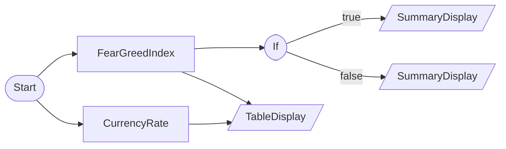

# External Market Data (No Credentials Required)

CurrencyRateNode + FearGreedIndexNode + IfNode combination. Can be tested after market close.

## Workflow Structure



## Node List

| ID | Type | Description |
|----|------|------|
| start | StartNode | Workflow start |
| fx | CurrencyRateNode | Currency rate query |
| fgi | FearGreedIndexNode | Fear & Greed Index query |
| if_fear | IfNode | Conditional branch (if/else) |
| fear_alert | SummaryDisplayNode | Summary dashboard |
| normal_status | SummaryDisplayNode | Summary dashboard |
| market_overview | TableDisplayNode | Table display output |

## Key Settings

- **if_fear**: `{{ nodes.fgi.value }}` <= `25`

## Data Flow

1. **start** (StartNode) --> **fx** (CurrencyRateNode)
1. **start** (StartNode) --> **fgi** (FearGreedIndexNode)
1. **fgi** (FearGreedIndexNode) --> **if_fear** (IfNode)
1. **if_fear** (IfNode) --true--> **fear_alert** (SummaryDisplayNode)
1. **if_fear** (IfNode) --false--> **normal_status** (SummaryDisplayNode)
1. **fx** (CurrencyRateNode) --> **market_overview** (TableDisplayNode)
1. **fgi** (FearGreedIndexNode) --> **market_overview** (TableDisplayNode)

## How to Run

```python
from programgarden import ProgramGarden

pg = ProgramGarden()
job = await pg.run_async(workflow)
```
