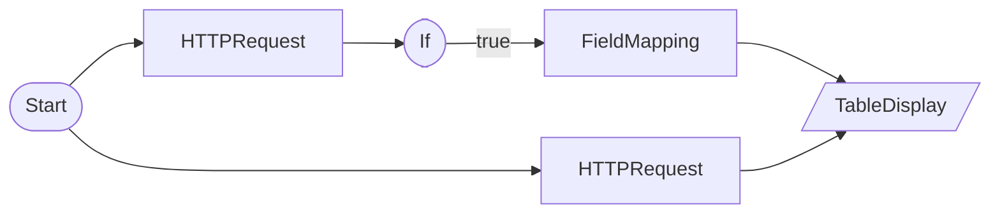

# HTTP Resilience Test (No Credentials Required)

HTTPRequestNode default retry enabled (H-21) + JSON parsing safety + IfNode branch validation

## Workflow Structure

## Node List

| ID | Type | Description |
|----|------|------|
| start | StartNode | Workflow start |
| api_json | HTTPRequestNode | HTTP API request |
| api_headers | HTTPRequestNode | HTTP API request |
| if_success | IfNode | Conditional branch (if/else) |
| mapper | FieldMappingNode | Field mapping/transformation |
| result | TableDisplayNode | Table display output |

## Key Settings

- **api_json**: `https://httpbin.org/json`
- **api_headers**: `https://httpbin.org/headers`
- **if_success**: `{{ nodes['api_json'].status_code }}` == `200`

## Data Flow

1. **start** (StartNode) --> **api_json** (HTTPRequestNode)
1. **start** (StartNode) --> **api_headers** (HTTPRequestNode)
1. **api_json** (HTTPRequestNode) --> **if_success** (IfNode)
1. **if_success** (IfNode) --true--> **mapper** (FieldMappingNode)
1. **mapper** (FieldMappingNode) --> **result** (TableDisplayNode)
1. **api_headers** (HTTPRequestNode) --> **result** (TableDisplayNode)
