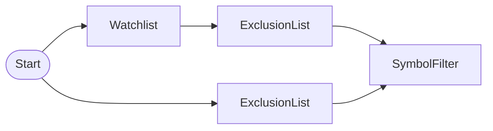

# Exclusion List Management (ExclusionListNode)

ExclusionListNode 3-pattern test: declare exclusion list, direct filtering, SymbolFilterNode integration

## Workflow Structure



## Node List

| ID | Type | Description |
|----|------|------|
| start | StartNode | Workflow start |
| watchlist | WatchlistNode | Define watchlist symbols |
| exclusion | ExclusionListNode | Exclusion list management |
| exclusion_only | ExclusionListNode | Exclusion list management |
| filter | SymbolFilterNode | Symbol filter (intersection/difference/union) |

## Key Settings

- **watchlist**: AAPL, NVDA, TSLA, BA, JPM
- **exclusion**: NVDA, BA
- **exclusion_only**: TSLA

## Data Flow

1. **start** (StartNode) --> **watchlist** (WatchlistNode)
1. **start** (StartNode) --> **exclusion_only** (ExclusionListNode)
1. **watchlist** (WatchlistNode) --> **exclusion** (ExclusionListNode)
1. **exclusion** (ExclusionListNode) --> **filter** (SymbolFilterNode)
1. **exclusion_only** (ExclusionListNode) --> **filter** (SymbolFilterNode)

## How to Run

```python
from programgarden import ProgramGarden

pg = ProgramGarden()
job = await pg.run_async(workflow)
```
