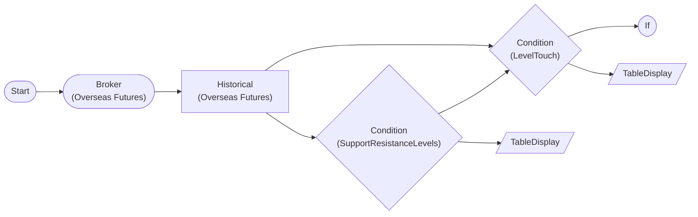

# S/R Level Detection + Touch Check (Overseas Futures Paper Trading)

Detect support/resistance levels from historical data with SupportResistanceLevels, then determine level touch/breakout with LevelTouch. Single symbol (Mini Hang Seng).

## Workflow Structure



## Node List

| ID | Type | Description |
|----|------|------|
| start | StartNode | Workflow start |
| broker | OverseasFuturesBrokerNode | Overseas futures broker connection (paper trading, HKEX) |
| hist | OverseasFuturesHistoricalDataNode | Overseas futures historical data query |
| detect_levels | ConditionNode | Condition check (plugin-based) |
| touch_check | ConditionNode | Condition check (plugin-based) |
| if_buy | IfNode | Conditional branch (if/else) |
| sr_table | TableDisplayNode | Table display output |
| touch_table | TableDisplayNode | Table display output |

## Key Settings

- **broker**: Paper trading mode
- **detect_levels**: Plugin `SupportResistanceLevels`
- **detect_levels**: lookback=60, swing_strength=3, cluster_tolerance=0.015, min_cluster_size=2
- **touch_check**: Plugin `LevelTouch`
- **touch_check**: levels={{ nodes.detect_levels.symbol_results }}, touch_tolerance=0.01, breakout_threshold=0.015, confirm_bars=2
- **if_buy**: `{{ nodes.touch_check.result }}` == `True`

## Required Credentials

| ID | Type | Description |
|----|------|------|
| broker_cred | broker_ls_overseas_futures | LS Securities Overseas Futures API (paper trading, HKEX only) |

## Data Flow

1. **start** (StartNode) --> **broker** (OverseasFuturesBrokerNode)
1. **broker** (OverseasFuturesBrokerNode) --> **hist** (OverseasFuturesHistoricalDataNode)
1. **hist** (OverseasFuturesHistoricalDataNode) --> **detect_levels** (ConditionNode)
1. **hist** (OverseasFuturesHistoricalDataNode) --> **touch_check** (ConditionNode)
1. **detect_levels** (ConditionNode) --> **touch_check** (ConditionNode)
1. **touch_check** (ConditionNode) --> **if_buy** (IfNode)
1. **detect_levels** (ConditionNode) --> **sr_table** (TableDisplayNode)
1. **touch_check** (ConditionNode) --> **touch_table** (TableDisplayNode)

## How to Run

```python
from programgarden import ProgramGarden

pg = ProgramGarden()
job = await pg.run_async(workflow)
```
