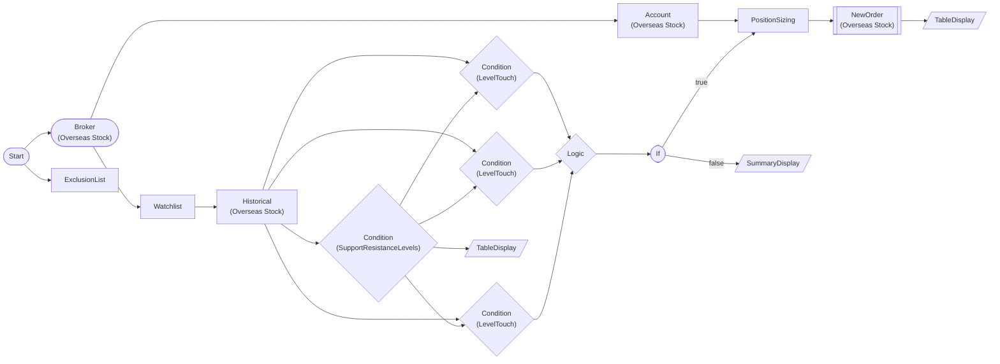

# S/R Level 3-Step Trading Strategy (Overseas Stock)

3 entry rules based on support/resistance levels: (1) First touch (initial re-contact) (2) Role reversal (pullback after breakout) (3) Cluster bounce. OR combination: buy entry when any rule is met.

> ## S/R Level 3-Step Trading Strategy

Three entry rules at support/resistance levels
evaluated in parallel; buy entry if any is met.

**Target**: AAPL, NVDA, MSFT, TSLA, META
**Data**: 90-day daily bars (swing_strength=3)
**Position**: 5% of account per symbol
**Safety**: ExclusionList auto-block

> Suppo

> ## 3 Entry Rules

### 1. First Touch
Strongest reaction at first re-contact after level formation.
Support touch = buy / Resistance touch = sell

### 2. Role Reversal
A strongly broken level acts in the opposite role.
Pullback after resistance breakout = support flip = buy
Breakout confirmation strengthened with confirm_bars=3

###

> ## Execution Flow

Watchlist (5Symbols)
  -> Query 90-day daily bars per symbol
    -> S/R level detection (bidirectional)
      -> LevelTouch 3 modes in parallel
        -> LogicNode OR combination
          -> IfNode branch
            -> TRUE: position sizing -> buy
            -> FALSE:

## Workflow Structure

## Node List

| ID | Type | Description |
|----|------|------|
| start | StartNode | Workflow start |
| broker | OverseasStockBrokerNode | Overseas stock broker connection |
| exclusion | ExclusionListNode | Exclusion list management |
| watchlist | WatchlistNode | Define watchlist symbols |
| account | OverseasStockAccountNode | Overseas stock account balance/position query |
| hist | OverseasStockHistoricalDataNode | Overseas stock historical data query |
| sr_detect | ConditionNode | Condition check (plugin-based) |
| touch_first | ConditionNode | Condition check (plugin-based) |
| touch_reversal | ConditionNode | Condition check (plugin-based) |
| touch_cluster | ConditionNode | Condition check (plugin-based) |
| logic_or | LogicNode | Logic combination (AND/OR/NOT) |
| if_signal | IfNode | Conditional branch (if/else) |
| sizing | PositionSizingNode | Position sizing calculation |
| buy_order | OverseasStockNewOrderNode | Overseas stock new order |
| signal_table | TableDisplayNode | Table display output |
| level_table | TableDisplayNode | Table display output |
| no_signal | SummaryDisplayNode | Summary dashboard |

## Key Settings

- **broker**: Live trading mode
- **exclusion**: SMCI, BABA
- **watchlist**: AAPL, NVDA, MSFT, TSLA, META
- **sr_detect**: Plugin `SupportResistanceLevels`
- **sr_detect**: lookback=60, swing_strength=3, cluster_tolerance=0.015, min_cluster_size=2
- **touch_first**: Plugin `LevelTouch`
- **touch_first**: levels={{ nodes.sr_detect.symbol_results }}, touch_tolerance=0.01, breakout_threshold=0.015, confirm_bars=2
- **touch_reversal**: Plugin `LevelTouch`
- **touch_reversal**: levels={{ nodes.sr_detect.symbol_results }}, touch_tolerance=0.01, breakout_threshold=0.02, confirm_bars=3
- **touch_cluster**: Plugin `LevelTouch`
- **touch_cluster**: levels={{ nodes.sr_detect.symbol_results }}, touch_tolerance=0.008, breakout_threshold=0.02, confirm_bars=2
- **logic_or**: `` any ``
- **if_signal**: `{{ nodes.logic_or.result }}` == `True`
- **buy_order**: side=`buy`

## Required Credentials

| ID | Type | Description |
|----|------|------|
| broker_cred | broker_ls_overseas_stock | LS Securities Overseas Stock API |

## Data Flow

1. **start** (StartNode) --> **broker** (OverseasStockBrokerNode)
1. **start** (StartNode) --> **exclusion** (ExclusionListNode)
1. **broker** (OverseasStockBrokerNode) --> **watchlist** (WatchlistNode)
1. **broker** (OverseasStockBrokerNode) --> **account** (OverseasStockAccountNode)
1. **watchlist** (WatchlistNode) --> **hist** (OverseasStockHistoricalDataNode)
1. **hist** (OverseasStockHistoricalDataNode) --> **sr_detect** (ConditionNode)
1. **sr_detect** (ConditionNode) --> **touch_first** (ConditionNode)
1. **sr_detect** (ConditionNode) --> **touch_reversal** (ConditionNode)
1. **sr_detect** (ConditionNode) --> **touch_cluster** (ConditionNode)
1. **hist** (OverseasStockHistoricalDataNode) --> **touch_first** (ConditionNode)
1. **hist** (OverseasStockHistoricalDataNode) --> **touch_reversal** (ConditionNode)
1. **hist** (OverseasStockHistoricalDataNode) --> **touch_cluster** (ConditionNode)
1. **touch_first** (ConditionNode) --> **logic_or** (LogicNode)
1. **touch_reversal** (ConditionNode) --> **logic_or** (LogicNode)
1. **touch_cluster** (ConditionNode) --> **logic_or** (LogicNode)
1. **logic_or** (LogicNode) --> **if_signal** (IfNode)
1. **if_signal** (IfNode) --true--> **sizing** (PositionSizingNode)
1. **if_signal** (IfNode) --false--> **no_signal** (SummaryDisplayNode)
1. **account** (OverseasStockAccountNode) --> **sizing** (PositionSizingNode)
1. **sizing** (PositionSizingNode) --> **buy_order** (OverseasStockNewOrderNode)
1. **buy_order** (OverseasStockNewOrderNode) --> **signal_table** (TableDisplayNode)
1. **sr_detect** (ConditionNode) --> **level_table** (TableDisplayNode)
