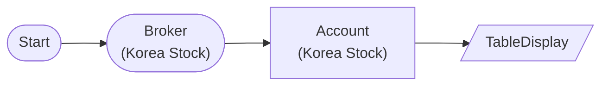

# Korea Stock Account Balance

KoreaStockBrokerNode → KoreaStockAccountNode: Query positions and deposit

## Workflow Structure

## Node List

| ID | Type | Description |
|----|------|------|
| start | StartNode | Workflow start |
| broker | KoreaStockBrokerNode | Korea stock broker connection |
| account | KoreaStockAccountNode | Korea stock account balance/position query |
| display | TableDisplayNode | Table display output |

## Required Credentials

| ID | Type | Description |
|----|------|------|
| broker_cred | broker_ls_korea_stock | LS Securities Korea Stock API |

## Data Flow

1. **start** (StartNode) --> **broker** (KoreaStockBrokerNode)
1. **broker** (KoreaStockBrokerNode) --> **account** (KoreaStockAccountNode)
1. **account** (KoreaStockAccountNode) --> **display** (TableDisplayNode)
