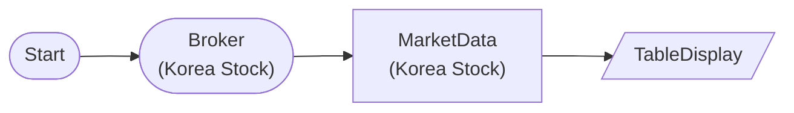

# Korea Stock Current Price

KoreaStockBrokerNode → KoreaStockMarketDataNode: Query Samsung, SK Hynix, Kakao market data

## Workflow Structure



## Node List

| ID | Type | Description |
|----|------|------|
| start | StartNode | Workflow start |
| broker | KoreaStockBrokerNode | Korea stock broker connection |
| market | KoreaStockMarketDataNode | Korea stock market data query |
| display | TableDisplayNode | Table display output |

## Key Settings

- **market**: 005930, 000660, 035720

## Required Credentials

| ID | Type | Description |
|----|------|------|
| broker_cred | broker_ls_korea_stock | LS Securities Korea Stock API |

## Data Flow

1. **start** (StartNode) --> **broker** (KoreaStockBrokerNode)
1. **broker** (KoreaStockBrokerNode) --> **market** (KoreaStockMarketDataNode)
1. **market** (KoreaStockMarketDataNode) --> **display** (TableDisplayNode)

## How to Run

```python
from programgarden import ProgramGarden

pg = ProgramGarden()
job = await pg.run_async(workflow)
```
