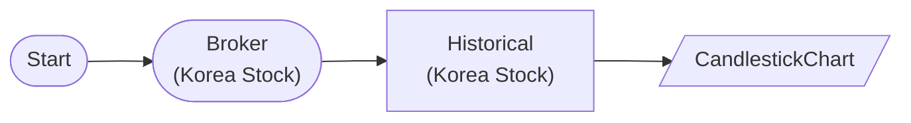

# Korea Stock Historical Data

KoreaStockBrokerNode → KoreaStockHistoricalDataNode: Query Samsung 60-day daily bars

## Workflow Structure



## Node List

| ID | Type | Description |
|----|------|------|
| start | StartNode | Workflow start |
| broker | KoreaStockBrokerNode | Korea stock broker connection |
| historical | KoreaStockHistoricalDataNode | Korea stock historical data query |
| display | CandlestickChartNode | Candlestick chart |

## Required Credentials

| ID | Type | Description |
|----|------|------|
| broker_cred | broker_ls_korea_stock | LS Securities Korea Stock API |

## Data Flow

1. **start** (StartNode) --> **broker** (KoreaStockBrokerNode)
1. **broker** (KoreaStockBrokerNode) --> **historical** (KoreaStockHistoricalDataNode)
1. **historical** (KoreaStockHistoricalDataNode) --> **display** (CandlestickChartNode)

## How to Run

```python
from programgarden import ProgramGarden

pg = ProgramGarden()
job = await pg.run_async(workflow)
```
