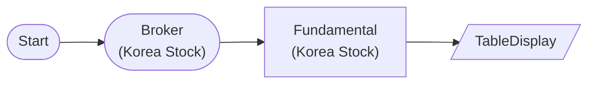

# Korea Stock Fundamental Data

KoreaStockBrokerNode → KoreaStockFundamentalNode: Query Samsung, SK Hynix PER/PBR

## Workflow Structure

## Node List

| ID | Type | Description |
|----|------|------|
| start | StartNode | Workflow start |
| broker | KoreaStockBrokerNode | Korea stock broker connection |
| fundamental | KoreaStockFundamentalNode | Korea stock fundamental data |
| display | TableDisplayNode | Table display output |

## Key Settings

- **fundamental**: 005930, 000660

## Required Credentials

| ID | Type | Description |
|----|------|------|
| broker_cred | broker_ls_korea_stock | LS Securities Korea Stock API |

## Data Flow

1. **start** (StartNode) --> **broker** (KoreaStockBrokerNode)
1. **broker** (KoreaStockBrokerNode) --> **fundamental** (KoreaStockFundamentalNode)
1. **fundamental** (KoreaStockFundamentalNode) --> **display** (TableDisplayNode)
