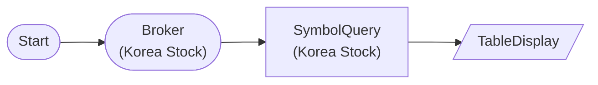

# Korea Stock Symbol Master Query

KoreaStockBrokerNode → KoreaStockSymbolQueryNode: Query all KOSPI symbols (max 50)

## Workflow Structure



## Node List

| ID | Type | Description |
|----|------|------|
| start | StartNode | Workflow start |
| broker | KoreaStockBrokerNode | Korea stock broker connection |
| symquery | KoreaStockSymbolQueryNode | Korea stock symbol search |
| display | TableDisplayNode | Table display output |

## Required Credentials

| ID | Type | Description |
|----|------|------|
| broker_cred | broker_ls_korea_stock | LS Securities Korea Stock API |

## Data Flow

1. **start** (StartNode) --> **broker** (KoreaStockBrokerNode)
1. **broker** (KoreaStockBrokerNode) --> **symquery** (KoreaStockSymbolQueryNode)
1. **symquery** (KoreaStockSymbolQueryNode) --> **display** (TableDisplayNode)

## How to Run

```python
from programgarden import ProgramGarden

pg = ProgramGarden()
job = await pg.run_async(workflow)
```
