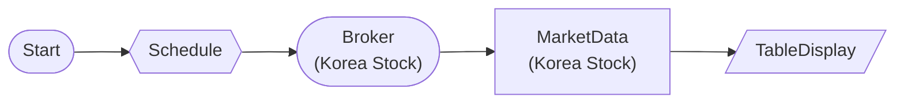

# Korea Stock Scheduled Recurring Query

Query Korea stock (Samsung, SK Hynix) current price every 10 seconds with ScheduleNode.
- cron: */10 * * * * * (second-level, 10s interval)
- Korea stock is live trading only (no paper_trading)
- Verify 2-3 cycles then stop with job.stop()

## Workflow Structure

## Node List

| ID | Type | Description |
|----|------|------|
| start | StartNode | Workflow start |
| schedule | ScheduleNode | Schedule trigger (cron) |
| broker | KoreaStockBrokerNode | Korea stock broker connection |
| market | KoreaStockMarketDataNode | Korea stock market data query |
| display | TableDisplayNode | Table display output |

## Key Settings

- **schedule**: cron `*/10 * * * * *` (timezone: Asia/Seoul)
- **market**: 005930, 000660

## Required Credentials

| ID | Type | Description |
|----|------|------|
| broker_cred | broker_ls_korea_stock | LS Securities Korea Stock API |

## Data Flow

1. **start** (StartNode) --> **schedule** (ScheduleNode)
1. **schedule** (ScheduleNode) --> **broker** (KoreaStockBrokerNode)
1. **broker** (KoreaStockBrokerNode) --> **market** (KoreaStockMarketDataNode)
1. **market** (KoreaStockMarketDataNode) --> **display** (TableDisplayNode)
