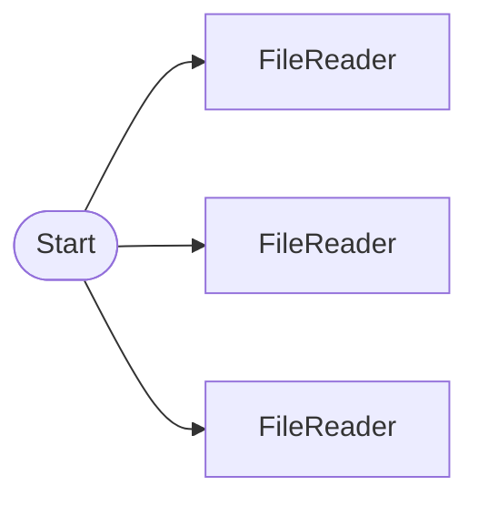

# FileReaderNode Integration Test

Validates FileReaderNode's 3 input patterns (file_path, file_data, multiple files) and format-specific parsing (TXT, CSV, JSON).

> ## FileReaderNode Integration Test
Parses base64-encoded TXT/CSV/JSON files.

## Workflow Structure

## Node List

| ID | Type | Description |
|----|------|------|
| start | StartNode | Workflow start |
| txt_reader | FileReaderNode | File reader (PDF, CSV, JSON, etc.) |
| csv_reader | FileReaderNode | File reader (PDF, CSV, JSON, etc.) |
| json_reader | FileReaderNode | File reader (PDF, CSV, JSON, etc.) |

## Data Flow

1. **start** (StartNode) --> **txt_reader** (FileReaderNode)
1. **start** (StartNode) --> **csv_reader** (FileReaderNode)
1. **start** (StartNode) --> **json_reader** (FileReaderNode)
