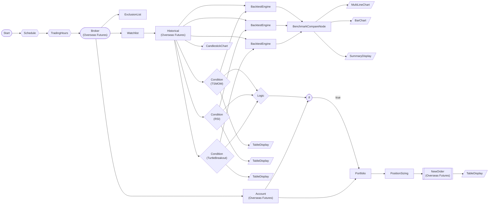

# Overseas Futures Paper Trading Multi-Strategy Backtest (Memory Stress)

HKEX overseas futures 4 symbols × 6-month data × 3 strategies (TSMOM/RSI/TurtleBreakout) backtest + benchmark comparison + conditional order. 28-node memory stress test.

> ## Overseas Futures Multi-Strategy Backtest Workflow

HKEX futures 4 symbols × 6-month daily bars × 3 parallel strategy backtests.
Memory stress test (28 nodes, 36 edges).

**Target**: HMCE, MHI, HTI, HCE (HKEX futures)
**Mode**: Paper trading (paper_trading=true)
**Data**: 180-day daily bars OHLCV
**Strategy**: TSMOM 

> ## 3 Strategy Details

### TSMOM (Time Series Momentum)
- lookback=60, vol_lookback=20
- ATR-based position sizing
- Short allowed, trailing stop 3%

### RSI Mean Reversion
- period=14, threshold=30 or below
- Fixed fraction 10% sizing
- take profit 1

> ## Memory Load Points

| Category | Count |
|------|------|
| Symbols | 4 HKEX |
| Daily bars | ~180 days/symbol |
| OHLCV records | ~720 |
| Condition evaluations | 4×3=12 times |
| Backtests | 4×3=12 times |
| Trade records | ~hundreds |
| Chart renders | 5 |
| Table renders | 4 |

Total estimated peak: high

> ## DAG Execution Flow

```
Start → Schedule → TradingHours → Broker
  ├→ Account ─────────────┐
  ├→ ExclusionList         │
  └→ Watchlist (4Symbols)     │
      └→ Historical (×4)  │
          ├→ TSMOM ──→ BT │
 

## Workflow Structure



## Node List

| ID | Type | Description |
|----|------|------|
| start | StartNode | Workflow start |
| schedule | ScheduleNode | Schedule trigger (cron) |
| trading_hours | TradingHoursFilterNode | Trading hours filter |
| broker | OverseasFuturesBrokerNode | Overseas futures broker connection (paper trading, HKEX) |
| account | OverseasFuturesAccountNode | Overseas futures account balance/position query |
| exclusion | ExclusionListNode | Exclusion list management |
| watchlist | WatchlistNode | Define watchlist symbols |
| historical | OverseasFuturesHistoricalDataNode | Overseas futures historical data query |
| tsmom_cond | ConditionNode | Condition check (plugin-based) |
| rsi_cond | ConditionNode | Condition check (plugin-based) |
| turtle_cond | ConditionNode | Condition check (plugin-based) |
| backtest_tsmom | BacktestEngineNode | Backtest engine |
| backtest_rsi | BacktestEngineNode | Backtest engine |
| backtest_turtle | BacktestEngineNode | Backtest engine |
| benchmark | BenchmarkCompareNode | Benchmark comparison |
| tsmom_table | TableDisplayNode | Table display output |
| rsi_table | TableDisplayNode | Table display output |
| turtle_table | TableDisplayNode | Table display output |
| equity_chart | MultiLineChartNode | Multi-line chart |
| candle_chart | CandlestickChartNode | Candlestick chart |
| metrics_chart | BarChartNode | Bar chart |
| summary_display | SummaryDisplayNode | Summary dashboard |
| logic | LogicNode | Logic combination (AND/OR/NOT) |
| if_balance | IfNode | Conditional branch (if/else) |
| portfolio | PortfolioNode | Portfolio risk management |
| sizing | PositionSizingNode | Position sizing calculation |
| new_order | OverseasFuturesNewOrderNode | Overseas futures new order |
| order_table | TableDisplayNode | Table display output |

## Key Settings

- **broker**: Paper trading mode
- **exclusion**: HSIM26, HHIM26
- **watchlist**: HMCEM26, MHIM26, HTIM26, HCEM26
- **tsmom_cond**: Plugin `TSMOM`
- **tsmom_cond**: lookback=60, volatility_lookback=20, threshold=0.0, volatility_target=0.15
- **rsi_cond**: Plugin `RSI`
- **rsi_cond**: period=14, threshold=30, direction=below
- **turtle_cond**: Plugin `TurtleBreakout`
- **turtle_cond**: entry_period=20, exit_period=10, atr_period=14, direction=both
- **logic**: `` any ``
- **if_balance**: `{{ nodes.account.balance.available }}` >= `50000`
- **new_order**: side=`buy`

## Required Credentials

| ID | Type | Description |
|----|------|------|
| futures_cred | broker_ls_overseas_futures | LS Securities Overseas Futures API (paper trading, HKEX only) |

## Data Flow

1. **start** (StartNode) --> **schedule** (ScheduleNode)
1. **schedule** (ScheduleNode) --> **trading_hours** (TradingHoursFilterNode)
1. **trading_hours** (TradingHoursFilterNode) --> **broker** (OverseasFuturesBrokerNode)
1. **broker** (OverseasFuturesBrokerNode) --> **account** (OverseasFuturesAccountNode)
1. **broker** (OverseasFuturesBrokerNode) --> **exclusion** (ExclusionListNode)
1. **broker** (OverseasFuturesBrokerNode) --> **watchlist** (WatchlistNode)
1. **watchlist** (WatchlistNode) --> **historical** (OverseasFuturesHistoricalDataNode)
1. **historical** (OverseasFuturesHistoricalDataNode) --> **tsmom_cond** (ConditionNode)
1. **historical** (OverseasFuturesHistoricalDataNode) --> **rsi_cond** (ConditionNode)
1. **historical** (OverseasFuturesHistoricalDataNode) --> **turtle_cond** (ConditionNode)
1. **historical** (OverseasFuturesHistoricalDataNode) --> **backtest_tsmom** (BacktestEngineNode)
1. **tsmom_cond** (ConditionNode) --> **backtest_tsmom** (BacktestEngineNode)
1. **historical** (OverseasFuturesHistoricalDataNode) --> **backtest_rsi** (BacktestEngineNode)
1. **rsi_cond** (ConditionNode) --> **backtest_rsi** (BacktestEngineNode)
1. **historical** (OverseasFuturesHistoricalDataNode) --> **backtest_turtle** (BacktestEngineNode)
1. **turtle_cond** (ConditionNode) --> **backtest_turtle** (BacktestEngineNode)
1. **backtest_tsmom** (BacktestEngineNode) --> **benchmark** (BenchmarkCompareNode)
1. **backtest_rsi** (BacktestEngineNode) --> **benchmark** (BenchmarkCompareNode)
1. **backtest_turtle** (BacktestEngineNode) --> **benchmark** (BenchmarkCompareNode)
1. **tsmom_cond** (ConditionNode) --> **tsmom_table** (TableDisplayNode)
1. **rsi_cond** (ConditionNode) --> **rsi_table** (TableDisplayNode)
1. **turtle_cond** (ConditionNode) --> **turtle_table** (TableDisplayNode)
1. **benchmark** (BenchmarkCompareNode) --> **equity_chart** (MultiLineChartNode)
1. **benchmark** (BenchmarkCompareNode) --> **metrics_chart** (BarChartNode)
1. **benchmark** (BenchmarkCompareNode) --> **summary_display** (SummaryDisplayNode)
1. **historical** (OverseasFuturesHistoricalDataNode) --> **candle_chart** (CandlestickChartNode)
1. **tsmom_cond** (ConditionNode) --> **logic** (LogicNode)
1. **rsi_cond** (ConditionNode) --> **logic** (LogicNode)
1. **turtle_cond** (ConditionNode) --> **logic** (LogicNode)
1. **logic** (LogicNode) --> **if_balance** (IfNode)
1. **account** (OverseasFuturesAccountNode) --> **if_balance** (IfNode)
1. **if_balance** (IfNode) --true--> **portfolio** (PortfolioNode)
1. **account** (OverseasFuturesAccountNode) --> **portfolio** (PortfolioNode)
1. **portfolio** (PortfolioNode) --> **sizing** (PositionSizingNode)
1. **sizing** (PositionSizingNode) --> **new_order** (OverseasFuturesNewOrderNode)
1. **new_order** (OverseasFuturesNewOrderNode) --> **order_table** (TableDisplayNode)

## How to Run

```python
from programgarden import ProgramGarden

pg = ProgramGarden()
job = await pg.run_async(workflow)
```
