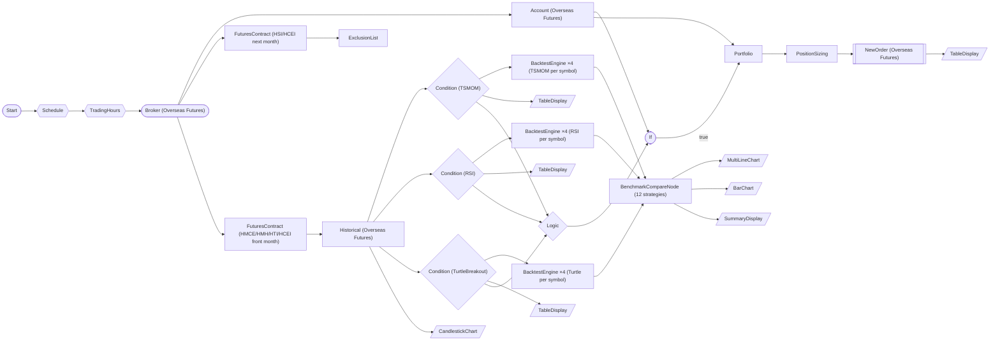

# Overseas Futures Paper Trading Multi-Strategy Per-Symbol Backtest (Memory Stress)

HKEX overseas futures 4 underlyings × 6-month data × 3 strategies (TSMOM/RSI/TurtleBreakout), split per symbol into 12 independent backtests (4 symbols × 3 strategies) + benchmark comparison + conditional order. The contract month is never hardcoded — `FuturesContractNode` resolves the currently listed front month at execution time, so the workflow keeps working after every expiry. 39-node memory stress test.

> ## Overseas Futures Multi-Strategy Per-Symbol Backtest Workflow

HKEX futures 4 underlyings × 6-month daily bars × 3 strategies, run as 12 per-symbol backtests (4×3).
Memory stress test (39 nodes, 54 edges).

**Target underlyings**: HMCE (Mini H-Shares), HMH (Mini Hang Seng), HTI (Hang Seng TECH), HCEI (H-Share) — HKEX
**Contract month**: resolved at execution time by the `contract` node (`FuturesContractNode`, front month); no month-coded symbol appears anywhere in the workflow
**Mode**: Paper trading (paper_trading=true)
**Data**: 180-day daily bars OHLCV
**Strategy**: TSMOM / RSI / TurtleBreakout (one independent backtest per symbol)

> **contract** 노드가 실행 시점에 LS 종목마스터를 조회해 상장 중인 근월물로 자동 해소하므로, 만기가 지나도 예제가 조용히 죽지 않습니다.

## Per-Symbol Backtest Restructure (why and how)

A backtest must be **per-symbol** and must consume the **strategy plugin's per-candle annotated series**, not the raw historical output.

- The `historical` node auto-iterates over the 4 contracts emitted by `contract.symbols`, so its `value` port is a **list** of `{symbol, exchange, time_series}` entries. Binding a single backtest to `{{ nodes.historical.value.time_series }}` accesses `.time_series` on that list, which yields nothing → "items 처리 결과가 비어있습니다" → empty backtest. Likewise binding `signal` to `{{ nodes.<cond>.result.signal }}` reads a merged list of booleans → `None`.
- Each `ConditionNode` (TSMOM / RSI / TurtleBreakout) emits a `values` array, one entry per symbol, in **contract (auto-iterate) order**, even when a symbol has insufficient data (`time_series: []`). So `nodes.<cond>.values[i]` is index-aligned with `contract.base_products[i]` (i.e. `contract.symbols[i]`).

Therefore each strategy is expanded into **4 per-symbol BacktestEngineNode** instances (12 total). For symbol index `i` under condition node `COND`:

```json
"items": {
  "from": "{{ nodes.COND.values[i].time_series }}",
  "extract": {
    "symbol":   "{{ nodes.COND.values[i].symbol }}",
    "exchange": "{{ nodes.COND.values[i].exchange }}",
    "date": "{{ row.date }}", "open": "{{ row.open }}", "high": "{{ row.high }}",
    "low": "{{ row.low }}", "close": "{{ row.close }}", "volume": "{{ row.volume }}",
    "signal": "<per-plugin signal mapping>"
  }
}
```

External bindings (no `row.`) like `symbol`/`exchange`/the `values[i]` selector are evaluated **once per node** (constant across rows); `row.x` bindings are evaluated **per candle**.

### Per-plugin per-candle signal mapping

The BacktestEngine's `_run_simulation` only acts on candles whose `signal` is `"buy"` / `"sell"` (optionally with a `side`); an empty signal list silently degrades to buy-and-hold. Each plugin annotates candles differently, so the mapping below is what makes the comparison meaningful:

| Strategy | Plugin id (`plugin` field) | Per-candle field | Mapping expression | side |
|----------|---------------------------|------------------|--------------------|------|
| TSMOM | `TimeSeriesMomentum` | `signal` ∈ {`long`,`short`,`neutral`} | `{{ 'buy' if row.signal == 'long' else ('sell' if row.signal == 'short' else None) }}` | not bound (default long) |
| RSI | `RSI` | `signal` ∈ {`buy`,`sell`,None} + `side` | `{{ row.signal }}` | `{{ row.side }}` |
| TurtleBreakout | `TurtleBreakout` | `entry_signal` / `exit_signal` (no `signal`) | `{{ 'buy' if row.entry_signal == 'long_entry' else ('sell' if row.exit_signal == 'long_exit' else None) }}` | not bound (default long) |

The 12 equity curves are fed to `BenchmarkCompareNode`, which ranks **all 12** strategy/symbol combinations by `sharpe` and drives the charts/summary.

> ## 3 Strategy Details

Each backtest consumes the ConditionNode's per-symbol annotated `time_series` (`nodes.<cond>.values[i].time_series`) and maps the plugin signal to BacktestEngine buy/sell.

### TSMOM (Time Series Momentum)
- Plugin id `TimeSeriesMomentum`; fields `lookback_days=60, signal_mode=binary, volatility_adjust=true, vol_target=0.15` (must match the plugin's `fields_schema` exactly — wrong field names silently fall back to defaults, e.g. `lookback_days=252`, which exceeds a 180-bar window and yields an empty signal series)
- ATR-based position sizing, short allowed, trailing stop 3%
- Mapping: `signal=='long'` → buy, `'short'` → sell (side not bound, defaults long)

### RSI Mean Reversion
- period=14, threshold=30 or below
- Fixed fraction 10% sizing, take profit 10%, time stop 14 days
- Mapping: `row.signal` (buy/sell) + `row.side` used directly

### Turtle Breakout
- entry=20 days, exit=10 days, ATR 2% risk sizing, short allowed, trailing stop 5%
- Mapping: `entry_signal=='long_entry'` → buy, `exit_signal=='long_exit'` → sell (side not bound)

> ## Memory Load Points

| Category | Count |
|------|------|
| Symbols | 4 HKEX |
| Daily bars | ~180 days/symbol |
| OHLCV records | ~720 |
| Condition evaluations | 4×3=12 times |
| Backtest nodes | 4×3=12 |
| Trade records | ~hundreds |
| Chart renders | 5 |
| Table renders | 4 |

Total estimated peak: historical data + 12 backtest trades + 12 equity curves.

> ## DAG Execution Flow

```
Start → Schedule → TradingHours → Broker
  ├→ Account
  ├→ ExclContract (next month) → ExclusionList
  └→ Contract (4 underlyings → 4 front months)
      └→ Historical (×4)
          ├→ TSMOM ──→ BT×4 ┐
          ├→ RSI ────→ BT×4 ┤
          └→ Turtle ─→ BT×4 ┘
              └→ Benchmark (ranks 12 strategies)
                  ├→ Charts
                  └→ Summary
          └→ Logic → If(balance)
              └→ Portfolio
                  └→ Sizing → Order
```

## Workflow Structure



`bt_tsmom` / `bt_rsi` / `bt_turtle` above each represent the 4 per-symbol BacktestEngineNode instances (`backtest_<strategy>_s0..s3`).

## Node List

| ID | Type | Description |
|----|------|------|
| start | StartNode | Workflow start |
| schedule | ScheduleNode | Schedule trigger (cron) |
| trading_hours | TradingHoursFilterNode | Trading hours filter |
| broker | OverseasFuturesBrokerNode | Overseas futures broker connection (paper trading, HKEX) |
| account | OverseasFuturesAccountNode | Overseas futures account balance/position query |
| excl_contract | FuturesContractNode | Resolves the **next**-month (roll-target, thinner) contracts of HSI / HCEI at execution time — feeds the exclusion list |
| exclusion | ExclusionListNode | Exclusion list management (symbols come from `excl_contract`, never hardcoded) |
| contract | FuturesContractNode | Resolves the listed **front**-month contracts of HMCE / HMH / HTI / HCEI at execution time; `symbols` output has the same shape as a watchlist ([{exchange, symbol}]) |
| historical | OverseasFuturesHistoricalDataNode | Overseas futures historical data query (auto-iterates the 4 resolved contracts) |
| tsmom_cond | ConditionNode | `TimeSeriesMomentum` plugin — annotates per-candle `signal` ∈ {long,short,neutral} |
| rsi_cond | ConditionNode | RSI plugin — annotates per-candle `signal`/`side` |
| turtle_cond | ConditionNode | TurtleBreakout plugin — annotates per-candle `entry_signal`/`exit_signal` |
| backtest_tsmom_s0..s3 | BacktestEngineNode | TSMOM per-symbol backtest (one per `contract` index) |
| backtest_rsi_s0..s3 | BacktestEngineNode | RSI per-symbol backtest (one per `contract` index) |
| backtest_turtle_s0..s3 | BacktestEngineNode | Turtle per-symbol backtest (one per `contract` index) |
| benchmark | BenchmarkCompareNode | Benchmark comparison across all 12 equity curves (ranking_metric=sharpe) |
| tsmom_table | TableDisplayNode | TSMOM per-symbol signal table |
| rsi_table | TableDisplayNode | RSI oversold table |
| turtle_table | TableDisplayNode | Turtle breakout table |
| equity_chart | MultiLineChartNode | Strategy equity curves (combined) |
| candle_chart | CandlestickChartNode | HKEX futures price chart |
| metrics_chart | BarChartNode | Strategy Sharpe ratio comparison |
| summary_display | SummaryDisplayNode | Benchmark ranking summary |
| logic | LogicNode | Logic combination (any) |
| if_balance | IfNode | Conditional branch on orderable balance |
| portfolio | PortfolioNode | Portfolio risk management |
| sizing | PositionSizingNode | Position sizing calculation |
| new_order | OverseasFuturesNewOrderNode | Overseas futures new order |
| order_table | TableDisplayNode | Order execution result table |

## Key Settings

- **broker**: Paper trading mode (HKEX only)
- **excl_contract**: `base_products: ["HSI", "HCEI"]`, `contract_selection: "next"`, `futures_exchange: "HKEX"`
- **exclusion**: `{{ nodes.excl_contract.symbols[0].symbol }}` (Hang Seng next month — thin liquidity), `{{ nodes.excl_contract.symbols[1].symbol }}` (H-Share next month — excess volatility). ExclusionListNode is not auto-iterated, so it reads the resolved symbols by index.
- **contract**: `base_products: ["HMCE", "HMH", "HTI", "HCEI"]` (underlying product codes — never month-coded symbols), `contract_selection: "front"`, `futures_exchange: "HKEX"`. Index order defines the per-symbol backtest indices: HMCE (index 0), HMH (1), HTI (2), HCEI (3)
- **tsmom_cond**: Plugin `TSMOM` — lookback=60, volatility_lookback=20, threshold=0.0, volatility_target=0.15, direction=long
- **rsi_cond**: Plugin `RSI` — period=14, threshold=30, direction=below
- **turtle_cond**: Plugin `TurtleBreakout` — entry_period=20, exit_period=10, atr_period=14, direction=both
- **backtest_tsmom_s\***: from `nodes.tsmom_cond.values[i].time_series`, signal maps long→buy / short→sell (no side); ATR-based sizing, allow_short
- **backtest_rsi_s\***: from `nodes.rsi_cond.values[i].time_series`, signal=`row.signal`, side=`row.side`; fixed-percent sizing
- **backtest_turtle_s\***: from `nodes.turtle_cond.values[i].time_series`, signal maps long_entry→buy / long_exit→sell (no side); ATR-based sizing, allow_short
- **benchmark**: ranking_metric=`sharpe`, 12 equity-curve strategies, distinct strategy_name per symbol — the label carries the **resolved** contract, e.g. `"TSMOM Momentum — {{ nodes.contract.symbols[0].symbol }}"`
- **logic**: `any`
- **if_balance**: `{{ nodes.account.balance.orderable_amount }}` >= `50000`
- **new_order**: side=`buy`

## Required Credentials

| ID | Type | Description |
|----|------|------|
| futures_cred | broker_ls_overseas_futures | LS Securities Overseas Futures API (paper trading, HKEX only) |

## Data Flow

1. **start** → **schedule** → **trading_hours** → **broker**
1. **broker** → **account** / **excl_contract** / **contract** (both FuturesContractNodes need the LS session — the o3101 master query)
1. **excl_contract** → **exclusion** (next-month HSI / HCEI contracts, resolved at run time)
1. **contract** → **historical** (auto-iterates the 4 resolved front-month contracts)
1. **historical** → **tsmom_cond** / **rsi_cond** / **turtle_cond**
1. **tsmom_cond** → **backtest_tsmom_s0..s3** (one per symbol)
1. **rsi_cond** → **backtest_rsi_s0..s3** (one per symbol)
1. **turtle_cond** → **backtest_turtle_s0..s3** (one per symbol)
1. **backtest_\*_s0..s3** (all 12) → **benchmark**
1. **benchmark** → **equity_chart** / **metrics_chart** / **summary_display**
1. **historical** → **candle_chart**
1. **tsmom_cond** / **rsi_cond** / **turtle_cond** → **logic**
1. **logic** → **if_balance**; **account** → **if_balance**
1. **if_balance** --true--> **portfolio**; **account** → **portfolio**
1. **portfolio** → **sizing** → **new_order** → **order_table**
