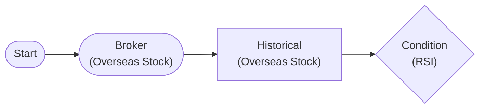

# Notification RSI Test

on_notification callback verification: WORKFLOW_STARTED + SIGNAL_TRIGGERED + WORKFLOW_COMPLETED

## Workflow Structure



## Node List

| ID | Type | Description |
|----|------|------|
| start | StartNode | Workflow start |
| broker | OverseasStockBrokerNode | Overseas stock broker connection |
| historical | OverseasStockHistoricalDataNode | Overseas stock historical data query |
| rsi | ConditionNode | Condition check (plugin-based) |

## Key Settings

- **broker**: Live trading mode
- **historical**: AAPL, MSFT, NVDA
- **rsi**: Plugin `RSI`
- **rsi**: period=14, threshold=70, direction=below

## Required Credentials

| ID | Type | Description |
|----|------|------|
| broker_cred | broker_ls_overseas_stock | LS Securities Overseas Stock API |

## Data Flow

1. **start** (StartNode) --> **broker** (OverseasStockBrokerNode)
1. **broker** (OverseasStockBrokerNode) --> **historical** (OverseasStockHistoricalDataNode)
1. **historical** (OverseasStockHistoricalDataNode) --> **rsi** (ConditionNode)

## How to Run

```python
from programgarden import ProgramGarden

pg = ProgramGarden()
job = await pg.run_async(workflow)
```
