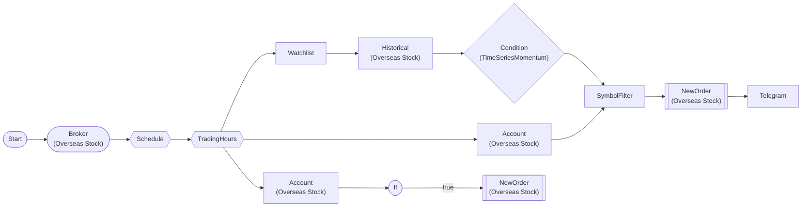

# Trend Following Auto-Trading (Telegram)

Buy top TSMOM trend + sell at -5% stop loss. Empty slots auto-filled in next cycle.

> ## Trend Following Auto-Trading

**Buy**: evaluate TSMOM 60-day trend for 3 watchlist symbols
  → exclude held positions → buy 1 share if momentum positive

**Sell**: IfNode checks per-item pnl_rate <= -5%
  → sell all at market price when stop loss triggered

**Interval**: 5 min (weekdays 24h, KST)
**Risk management**: -5% stop loss

## Workflow Structure

## Node List

| ID | Type | Description |
|----|------|------|
| start | StartNode | Workflow start |
| broker | OverseasStockBrokerNode | Overseas stock broker connection |
| schedule | ScheduleNode | Schedule trigger (cron) |
| trading_hours | TradingHoursFilterNode | Trading hours filter |
| account | OverseasStockAccountNode | Overseas stock account balance/position query |
| watchlist | WatchlistNode | Define watchlist symbols |
| historical | OverseasStockHistoricalDataNode | Overseas stock historical data query |
| tsmom | ConditionNode | Condition check (plugin-based) |
| filter_buy | SymbolFilterNode | Symbol filter (intersection/difference/union) |
| buy_order | OverseasStockNewOrderNode | Overseas stock new order |
| telegram_buy | TelegramNode | Send Telegram message |
| account_sell | OverseasStockAccountNode | Overseas stock account balance/position query |
| if_stop_loss | IfNode | Conditional branch (if/else) |
| sell_order | OverseasStockNewOrderNode | Overseas stock new order |

## Key Settings

- **broker**: Live trading mode
- **schedule**: cron `*/5 * * * 1-5` (timezone: Asia/Seoul)
- **trading_hours**: 00:00~23:59 (Asia/Seoul)
- **watchlist**: SOFI, AUID, GOSS
- **tsmom**: Plugin `TimeSeriesMomentum`
- **tsmom**: lookback_days=60, signal_mode=binary, volatility_adjust=False
- **buy_order**: side=`buy`
- **if_stop_loss**: `{{ item.pnl_rate }}` <= `-5`
- **sell_order**: side=`{{ item.close_side }}`

## Required Credentials

| ID | Type | Description |
|----|------|------|
| broker_cred | broker_ls_overseas_stock | LS Securities Overseas Stock API |
| telegram_cred | telegram | Telegram Bot |

## Data Flow

1. **start** (StartNode) --> **broker** (OverseasStockBrokerNode)
1. **broker** (OverseasStockBrokerNode) --> **schedule** (ScheduleNode)
1. **schedule** (ScheduleNode) --> **trading_hours** (TradingHoursFilterNode)
1. **trading_hours** (TradingHoursFilterNode) --> **account** (OverseasStockAccountNode)
1. **trading_hours** (TradingHoursFilterNode) --> **watchlist** (WatchlistNode)
1. **watchlist** (WatchlistNode) --> **historical** (OverseasStockHistoricalDataNode)
1. **historical** (OverseasStockHistoricalDataNode) --> **tsmom** (ConditionNode)
1. **tsmom** (ConditionNode) --> **filter_buy** (SymbolFilterNode)
1. **account** (OverseasStockAccountNode) --> **filter_buy** (SymbolFilterNode)
1. **filter_buy** (SymbolFilterNode) --> **buy_order** (OverseasStockNewOrderNode)
1. **buy_order** (OverseasStockNewOrderNode) --> **telegram_buy** (TelegramNode)
1. **trading_hours** (TradingHoursFilterNode) --> **account_sell** (OverseasStockAccountNode)
1. **account_sell** (OverseasStockAccountNode) --> **if_stop_loss** (IfNode)
1. **if_stop_loss** (IfNode) --true--> **sell_order** (OverseasStockNewOrderNode)
