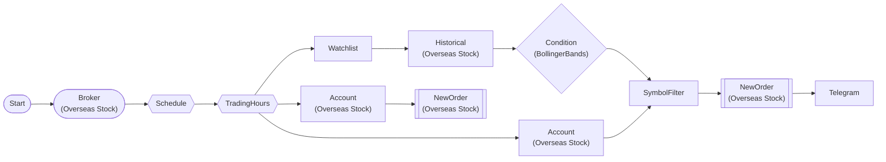

# Bollinger Band Mean Reversion Auto-Trading (Telegram)

Monitor 6 large-cap tech stocks. Buy oversold on lower Bollinger Band touch, rotate sell held positions. 30-min interval automation.

> ## Bollinger Band Mean Reversion Auto-Trading

**Strategy**: Mean Reversion

**Buy**: Evaluate Bollinger Bands(20,2) for 6 watchlist symbols
  → Below lower band = oversold
  → Buy after excluding held positions (1 share)

**Sell**: Liquidate all held positions
  (Re-evaluate conditions in next cycle)

**Interval**: 30 min (weekdays 09:30-15:55 ET

## Workflow Structure



## Node List

| ID | Type | Description |
|----|------|------|
| start | StartNode | Workflow start |
| broker | OverseasStockBrokerNode | Overseas stock broker connection |
| schedule | ScheduleNode | Schedule trigger (cron) |
| trading_hours | TradingHoursFilterNode | Trading hours filter |
| account | OverseasStockAccountNode | Overseas stock account balance/position query |
| watchlist | WatchlistNode | Define watchlist symbols |
| historical | OverseasStockHistoricalDataNode | Overseas stock historical data query |
| bollinger | ConditionNode | Condition check (plugin-based) |
| filter_buy | SymbolFilterNode | Symbol filter (intersection/difference/union) |
| buy_order | OverseasStockNewOrderNode | Overseas stock new order |
| telegram_buy | TelegramNode | Send Telegram message |
| account_sell | OverseasStockAccountNode | Overseas stock account balance/position query |
| sell_order | OverseasStockNewOrderNode | Overseas stock new order |

## Key Settings

- **broker**: Live trading mode
- **schedule**: cron `*/30 * * * 1-5` (timezone: America/New_York)
- **trading_hours**: 09:30~15:55 (America/New_York)
- **watchlist**: SOFI, RIVN, LCID, GRAB, OPEN and 1 more
- **bollinger**: Plugin `BollingerBands`
- **bollinger**: period=20, std_dev=2.0, position=below_lower
- **buy_order**: side=`buy`
- **sell_order**: side=`{{ item.close_side }}`

## Required Credentials

| ID | Type | Description |
|----|------|------|
| broker_cred | broker_ls_overseas_stock | LS Securities Overseas Stock API |
| telegram_cred | telegram | Telegram Bot |

## Data Flow

1. **start** (StartNode) --> **broker** (OverseasStockBrokerNode)
1. **broker** (OverseasStockBrokerNode) --> **schedule** (ScheduleNode)
1. **schedule** (ScheduleNode) --> **trading_hours** (TradingHoursFilterNode)
1. **trading_hours** (TradingHoursFilterNode) --> **account** (OverseasStockAccountNode)
1. **trading_hours** (TradingHoursFilterNode) --> **watchlist** (WatchlistNode)
1. **watchlist** (WatchlistNode) --> **historical** (OverseasStockHistoricalDataNode)
1. **historical** (OverseasStockHistoricalDataNode) --> **bollinger** (ConditionNode)
1. **bollinger** (ConditionNode) --> **filter_buy** (SymbolFilterNode)
1. **account** (OverseasStockAccountNode) --> **filter_buy** (SymbolFilterNode)
1. **filter_buy** (SymbolFilterNode) --> **buy_order** (OverseasStockNewOrderNode)
1. **buy_order** (OverseasStockNewOrderNode) --> **telegram_buy** (TelegramNode)
1. **trading_hours** (TradingHoursFilterNode) --> **account_sell** (OverseasStockAccountNode)
1. **account_sell** (OverseasStockAccountNode) --> **sell_order** (OverseasStockNewOrderNode)

## How to Run

```python
from programgarden import ProgramGarden

pg = ProgramGarden()
job = await pg.run_async(workflow)
```
