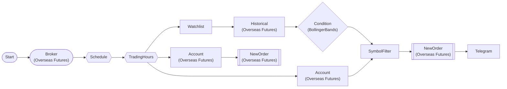

# HKEX Mini Futures Mean Reversion Auto-Trading (Paper Trading)

Mini Hang Seng / Mini H-Shares 2-symbol Bollinger Band mean reversion. Long entry on lower band touch, rotate liquidate held positions. 30-min interval paper trading.

> ## HKEX Mini Futures Mean Reversion Bot (Paper Trading)

**Strategy**: Bollinger Bands(20,2) Mean Reversion

**Buy (Long)**: Mini Hang Seng / Mini H-Shares lower Bollinger touch
  → Oversold = long 1 contract
  → Exclude held positions

**Liquidate**: Close all held positions with opposite trade

**Interval**: 30 min (weekdays 09:15-16:30 HKT)

**Symbols**: HMHJ26 (Mini Hang Seng Apr), H

## Workflow Structure



## Node List

| ID | Type | Description |
|----|------|------|
| start | StartNode | Workflow start |
| broker | OverseasFuturesBrokerNode | Overseas futures broker connection (paper trading, HKEX) |
| schedule | ScheduleNode | Schedule trigger (cron) |
| trading_hours | TradingHoursFilterNode | Trading hours filter |
| account | OverseasFuturesAccountNode | Overseas futures account balance/position query |
| watchlist | WatchlistNode | Define watchlist symbols |
| historical | OverseasFuturesHistoricalDataNode | Overseas futures historical data query |
| bollinger | ConditionNode | Condition check (plugin-based) |
| filter_buy | SymbolFilterNode | Symbol filter (intersection/difference/union) |
| buy_order | OverseasFuturesNewOrderNode | Overseas futures new order |
| telegram_buy | TelegramNode | Send Telegram message |
| account_sell | OverseasFuturesAccountNode | Overseas futures account balance/position query |
| sell_order | OverseasFuturesNewOrderNode | Overseas futures new order |

## Key Settings

- **broker**: Paper trading mode
- **schedule**: cron `*/30 * * * 1-5` (timezone: Asia/Hong_Kong)
- **trading_hours**: 09:15~16:30 (Asia/Hong_Kong)
- **watchlist**: HMHJ26, HMCEJ26
- **bollinger**: Plugin `BollingerBands`
- **bollinger**: period=20, std_dev=2.0, position=below_lower
- **buy_order**: side=`buy`
- **sell_order**: side=`{{ item.close_side }}`

## Required Credentials

| ID | Type | Description |
|----|------|------|
| broker_cred | broker_ls_overseas_futures | LS Securities Overseas Futures API (paper trading, HKEX only) |
| telegram_cred | telegram | Telegram Bot |

## Data Flow

1. **start** (StartNode) --> **broker** (OverseasFuturesBrokerNode)
1. **broker** (OverseasFuturesBrokerNode) --> **schedule** (ScheduleNode)
1. **schedule** (ScheduleNode) --> **trading_hours** (TradingHoursFilterNode)
1. **trading_hours** (TradingHoursFilterNode) --> **account** (OverseasFuturesAccountNode)
1. **trading_hours** (TradingHoursFilterNode) --> **watchlist** (WatchlistNode)
1. **watchlist** (WatchlistNode) --> **historical** (OverseasFuturesHistoricalDataNode)
1. **historical** (OverseasFuturesHistoricalDataNode) --> **bollinger** (ConditionNode)
1. **bollinger** (ConditionNode) --> **filter_buy** (SymbolFilterNode)
1. **account** (OverseasFuturesAccountNode) --> **filter_buy** (SymbolFilterNode)
1. **filter_buy** (SymbolFilterNode) --> **buy_order** (OverseasFuturesNewOrderNode)
1. **buy_order** (OverseasFuturesNewOrderNode) --> **telegram_buy** (TelegramNode)
1. **trading_hours** (TradingHoursFilterNode) --> **account_sell** (OverseasFuturesAccountNode)
1. **account_sell** (OverseasFuturesAccountNode) --> **sell_order** (OverseasFuturesNewOrderNode)

## How to Run

```python
from programgarden import ProgramGarden

pg = ProgramGarden()
job = await pg.run_async(workflow)
```
