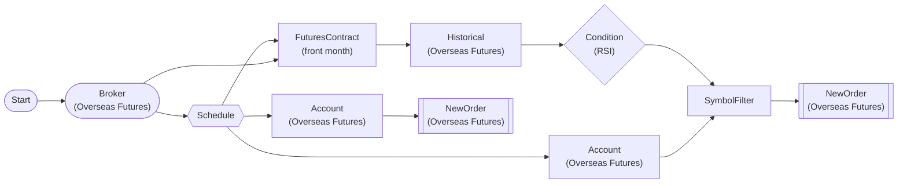

# RSI Oversold Overseas Futures Auto-Trading (Paper Trading)

HKEX mini futures RSI(14) oversold (<=30) long entry, liquidate held positions every cycle. 1-min interval paper trading.

> ## RSI Oversold Overseas Futures Bot (Paper Trading)

**Strategy**: RSI(14) oversold mean reversion

**Buy (Long)**: RSI < 30 oversold symbols
  -> Long 1 contract for non-held symbols only

**Liquidate**: Close all held positions with opposite trade

**Interval**: Every 1 min (no TradingHoursFilter)

**종목**: 미니 항셍(HMH), 미니 H주(HMCE) — `FuturesContractNode` 가 실행 시점에 LS 종목마스터를 조회해 **근월물로 자동 해소**한다. 월물 코드를 하드코딩하지 않으므로 만기가 지나도 워크플로우가 죽지 않는다.

## Workflow Structure

## Node List

| ID | Type | Description |
|----|------|------|
| start | StartNode | Workflow start |
| broker | OverseasFuturesBrokerNode | Overseas futures broker connection (paper trading, HKEX) |
| schedule | ScheduleNode | Schedule trigger (cron) |
| account | OverseasFuturesAccountNode | Overseas futures account balance/position query |
| contract | FuturesContractNode | 기초자산(HMH/HMCE) → 현재 상장 근월물 해소 (o3101, 실행 시점) |
| historical | OverseasFuturesHistoricalDataNode | Overseas futures historical data query |
| rsi | ConditionNode | Condition check (plugin-based) |
| filter_buy | SymbolFilterNode | Symbol filter (intersection/difference/union) |
| buy_order | OverseasFuturesNewOrderNode | Overseas futures new order |
| account_sell | OverseasFuturesAccountNode | Overseas futures account balance/position query |
| sell_order | OverseasFuturesNewOrderNode | Overseas futures new order |

## Key Settings

- **broker**: Paper trading mode
- **schedule**: cron `*/1 * * * *` (timezone: Asia/Hong_Kong)
- **contract**: base_products=`["HMH", "HMCE"]`, contract_selection=`front`, futures_exchange=`HKEX` (월물은 실행 시점에 해소)
- **rsi**: Plugin `RSI`
- **rsi**: period=14, threshold=30, direction=below
- **buy_order**: side=`buy`
- **sell_order**: side=`{{ item.close_side }}`

## Required Credentials

| ID | Type | Description |
|----|------|------|
| broker_cred | broker_ls_overseas_futures | LS Securities Overseas Futures API (paper trading, HKEX only) |

## Data Flow

1. **start** (StartNode) --> **broker** (OverseasFuturesBrokerNode)
1. **broker** (OverseasFuturesBrokerNode) --> **schedule** (ScheduleNode)
1. **schedule** (ScheduleNode) --> **account** (OverseasFuturesAccountNode)
1. **schedule** (ScheduleNode) --> **contract** (FuturesContractNode)
1. **broker** (OverseasFuturesBrokerNode) --> **contract** (FuturesContractNode)
1. **contract** (FuturesContractNode) --> **historical** (OverseasFuturesHistoricalDataNode)
1. **historical** (OverseasFuturesHistoricalDataNode) --> **rsi** (ConditionNode)
1. **rsi** (ConditionNode) --> **filter_buy** (SymbolFilterNode)
1. **account** (OverseasFuturesAccountNode) --> **filter_buy** (SymbolFilterNode)
1. **filter_buy** (SymbolFilterNode) --> **buy_order** (OverseasFuturesNewOrderNode)
1. **schedule** (ScheduleNode) --> **account_sell** (OverseasFuturesAccountNode)
1. **account_sell** (OverseasFuturesAccountNode) --> **sell_order** (OverseasFuturesNewOrderNode)
