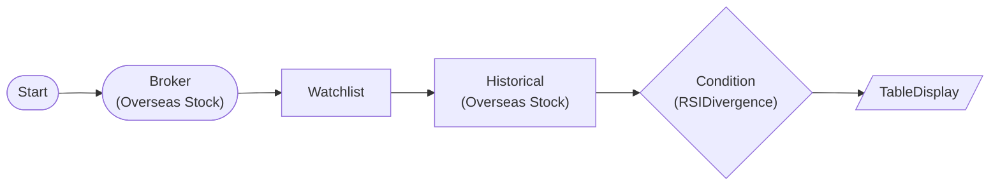

# RSI Divergence

Detects bullish/bearish divergence between price and RSI. Bullish divergence (price lower low + RSI higher low) signals potential reversal up. Bearish divergence (price higher high + RSI lower high) signals potential reversal down.

> ## RSI Divergence
- Bullish: Price Lower Low + RSI Higher Low → Reversal up
- Bearish: Price Higher High + RSI Lower High → Reversal down
- pivot_window controls peak/trough detection sensitivity

## Workflow Structure

## Node List

| ID | Type | Description |
|----|------|------|
| start | StartNode | Workflow start |
| broker | OverseasStockBrokerNode | Overseas stock broker connection |
| watchlist | WatchlistNode | Define watchlist symbols |
| historical | OverseasStockHistoricalDataNode | 90-day historical OHLCV |
| divergence | ConditionNode | RSI Divergence detection |
| result_table | TableDisplayNode | Divergence results display |

## Key Settings

- **watchlist**: AAPL, TSLA, NVDA
- **divergence**: Plugin `RSIDivergence`
- **divergence**: rsi_period=14, lookback=50, pivot_window=5, divergence_type=both

## Required Credentials

| ID | Type | Description |
|----|------|------|
| broker_cred | broker_ls_overseas_stock | LS Securities Overseas Stock API |

## Data Flow

1. **start** --> **broker** --> **watchlist** --> **historical** (auto-iterate per symbol)
1. **historical** --> **divergence** (items.extract: symbol, exchange, date, close)
1. **divergence** --> **result_table** (symbol_results with rsi, divergence, divergence_strength)
