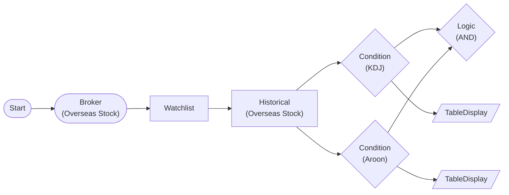

# KDJ + Aroon Combined Strategy

Combines KDJ golden cross with Aroon uptrend using LogicNode AND. Strong buy signal when both conditions are met simultaneously.

> ## KDJ + Aroon
- KDJ Golden Cross: K line crosses above D line
- Aroon Uptrend: Aroon Up > 70, Aroon Down < 30
- AND logic filters only high-confidence buy signals

## Workflow Structure

## Node List

| ID | Type | Description |
|----|------|------|
| start | StartNode | Workflow start |
| broker | OverseasStockBrokerNode | Overseas stock broker connection |
| watchlist | WatchlistNode | Define watchlist symbols |
| historical | OverseasStockHistoricalDataNode | 60-day historical OHLCV |
| kdj | ConditionNode | KDJ golden cross detection |
| aroon | ConditionNode | Aroon uptrend detection |
| logic | LogicNode | AND combination of KDJ + Aroon |
| kdj_table | TableDisplayNode | KDJ results (K, D, J values) |
| aroon_table | TableDisplayNode | Aroon results (Up, Down, Oscillator) |

## Key Settings

- **watchlist**: AAPL, MSFT, AMZN
- **kdj**: Plugin `KDJ`, n_period=9, k_smooth=3, d_smooth=3, signal_type=golden_cross
- **aroon**: Plugin `Aroon`, period=25, signal_type=uptrend, threshold=70

## Required Credentials

| ID | Type | Description |
|----|------|------|
| broker_cred | broker_ls_overseas_stock | LS Securities Overseas Stock API |

## Data Flow

1. **start** --> **broker** --> **watchlist** --> **historical** (auto-iterate per symbol)
1. **historical** --> **kdj** (items.extract: symbol, exchange, date, close, high, low)
1. **historical** --> **aroon** (items.extract: symbol, exchange, date, high, low)
1. **kdj** + **aroon** --> **logic** (AND: both must pass)
