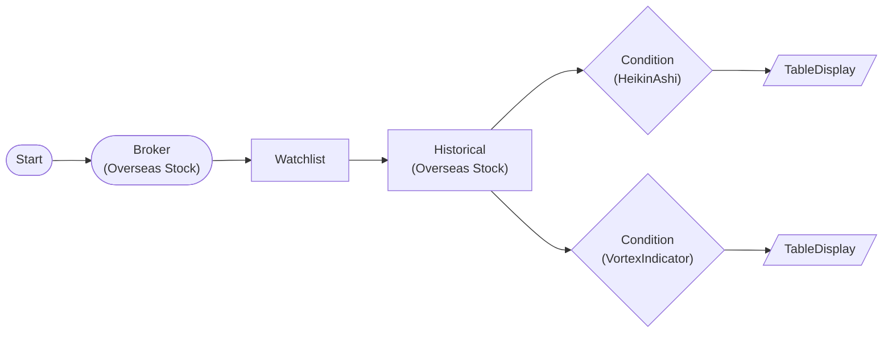

# Heikin-Ashi + Vortex Trend Confirmation

Uses Heikin-Ashi consecutive bullish candles for trend detection and Vortex Indicator for trend direction confirmation. High confidence when both agree.

> ## Heikin-Ashi + Vortex
- Heikin-Ashi: 3 consecutive bullish candles = uptrend signal
- Vortex: +VI > -VI = uptrend confirmation
- Both agreeing = high reliability trend

## Workflow Structure

## Node List

| ID | Type | Description |
|----|------|------|
| start | StartNode | Workflow start |
| broker | OverseasStockBrokerNode | Overseas stock broker connection |
| watchlist | WatchlistNode | Define watchlist symbols |
| historical | OverseasStockHistoricalDataNode | 60-day historical OHLCV |
| heikin_ashi | ConditionNode | Heikin-Ashi consecutive candle detection |
| vortex | ConditionNode | Vortex Indicator trend direction |
| ha_table | TableDisplayNode | HA results (ha_open, ha_close, consecutive counts) |
| vortex_table | TableDisplayNode | Vortex results (+VI, -VI) |

## Key Settings

- **watchlist**: AAPL, GOOGL, META
- **heikin_ashi**: Plugin `HeikinAshi`, consecutive_count=3, signal_type=bullish
- **vortex**: Plugin `VortexIndicator`, period=14, signal_type=bullish_trend

## Required Credentials

| ID | Type | Description |
|----|------|------|
| broker_cred | broker_ls_overseas_stock | LS Securities Overseas Stock API |

## Data Flow

1. **start** --> **broker** --> **watchlist** --> **historical** (auto-iterate per symbol)
1. **historical** --> **heikin_ashi** (items.extract: symbol, exchange, date, open, high, low, close)
1. **historical** --> **vortex** (items.extract: symbol, exchange, date, high, low, close)
