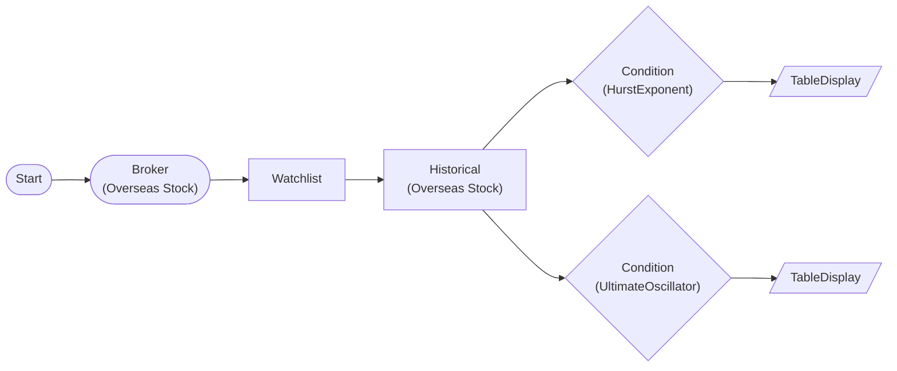

# Hurst Exponent Market Regime Classification

Classifies each symbol's market regime (trending/mean-reverting/random-walk) using Hurst exponent R/S analysis. Combined with Ultimate Oscillator for regime-appropriate strategy selection.

> ## Hurst + Ultimate Oscillator
- Hurst > 0.55 = trending regime = momentum strategy suitable
- Hurst < 0.45 = mean-reverting regime = contrarian strategy suitable
- UO oversold (< 30) in trending regime = high-conviction entry

## Workflow Structure

## Node List

| ID | Type | Description |
|----|------|------|
| start | StartNode | Workflow start |
| broker | OverseasStockBrokerNode | Overseas stock broker connection |
| watchlist | WatchlistNode | Define watchlist symbols |
| historical | OverseasStockHistoricalDataNode | 1-year historical OHLCV |
| hurst | ConditionNode | Hurst exponent regime classification |
| uo | ConditionNode | Ultimate Oscillator overbought/oversold |
| hurst_table | TableDisplayNode | Hurst results (hurst value, regime) |
| uo_table | TableDisplayNode | UO results (uo value) |

## Key Settings

- **watchlist**: AAPL, MSFT, AMZN, NVDA
- **historical**: 252-day lookback (1 year)
- **hurst**: Plugin `HurstExponent`, min_window=10, max_window=100, h_threshold=0.55
- **uo**: Plugin `UltimateOscillator`, period1=7, period2=14, period3=28, oversold=30

## Required Credentials

| ID | Type | Description |
|----|------|------|
| broker_cred | broker_ls_overseas_stock | LS Securities Overseas Stock API |

## Data Flow

1. **start** --> **broker** --> **watchlist** --> **historical** (auto-iterate, 1-year data)
1. **historical** --> **hurst** (items.extract: symbol, exchange, date, close)
1. **historical** --> **uo** (items.extract: symbol, exchange, date, close, high, low)
